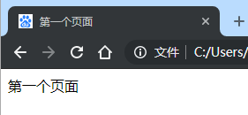

## 四、第一个页面

### 1、基础HTML模板

**模板标签解读：**

- DOCTYPE：指定⽂档类型，规定html标签语法
- html：⽂档根标签，标注着⽂档(⻚⾯)的开始与结束
- head：**⽂档头标签**，可以引⽤脚本⽂件、指定样式表、书写代码逻辑块、提供元信息
- body：**⽂档主体标签**，包含⽂档所有⽂本与超⽂本内容
- title：⽂档tag标题标签，设置⽂档tag的标题内容 

**文档类型**：标签语法为HTML5

```html
<!DOCTYPE html>
<!-- 文档类型;   -->
```

**HTML5语法特点**：

- 不区分大小写
- 有很多系统标签，一般都具有语义
- 可以随意定义自定义标签
- h5内容不保留空白字符（制表符） 

**文档根标签**：`<html lang="en">`

- html根标签只有一儿一女：head，body,所以可以省略缩进
- html语法中没有明确规定缩进规则，但从美观可读性出发，开发者要严格遵循缩进

**示例1：最简单的HTML模板**

```html
<!DOCTYPE html>
<html lang="en">
<head></head>
	<title></title>
<body>
</body>
</html>
```

> 一个页面只存在一个标准模板
>
> DOCTYPE文档类型必须出现在首行，用户描述此页面所用的HTML版本
>
> 如果没有书写模块，浏览器解析会按“自己心情”帮你添加模板

### 2、meta（元标签）

```html
<!-- 字符编码 -->
<meta charset="utf-8">
<meta http-equiv="content-type" content="text/html;charset=utf-8" /> 

<!-- SEO -->
<meta name="keywords" content="8-12个以英⽂逗号隔开的单词或词语">
<meta name="description" content="80字以内的⼀段话，与⽹站内容相关">

<!-- 移动适配 -->
<meta name="viewport" content="width=device-width,initial-scale=1,minimumscale=1,maximum-scale=1,user-scalable=no" />
```

**示例1：字符编码**

浏览器打开

```html
绗竴涓〉闈�   #浏览器打开
```

添加中文字符编码
```html
<!DOCTYPE html>
 
<html lang="en">
<head></head> 
	<meta charset="utf-8">
	<title>第一个页面</title>
<body>
	第一个页面
</body>
</html>
```

浏览器打开
```html
第一个页面  
```

**示例2：SEO**

[网页URL](https://www.sina.com.cn/)查看源代码中的，`<meta name="keywords"`中SEO搜索关键词

```html
<!DOCTYPE html>
<!-- [ published at 2019-05-09 16:45:00 ] -->
<html>
<head>
    <meta http-equiv="Content-type" content="text/html; charset=utf-8" />
    <meta http-equiv="X-UA-Compatible" content="IE=edge" />
    <title>新浪首页</title>
	<meta name="keywords" content="新浪,新浪网,SINA,sina,sina.com.cn,新浪首页,门户,资讯" />
```

### 3、link（链接标签） 

```html
<!-- 外联样式表 -->
<link rel="stylesheet" type="text/css" href="style.css" /> 

<!-- ⽂档tag图标 -->
<link rel="shortcut icon" type="image/x-icon"
href="http://www.baidu.com/favicon.ico" />
```

**示例1：只用百度tag图标**

```html
<!DOCTYPE html>
 
<html lang="en">
<head></head> 
	<meta charset="utf-8">
	<title>第一个页面</title>
	<link rel="shortcut icon" type="image/x-icon"
href="http://www.baidu.com/favicon.ico" />
<body>
	第一个页面
</body>
</html>
```



### 4、 script（脚步标签） 

```html
<script type="text/javascript"></script>
```

