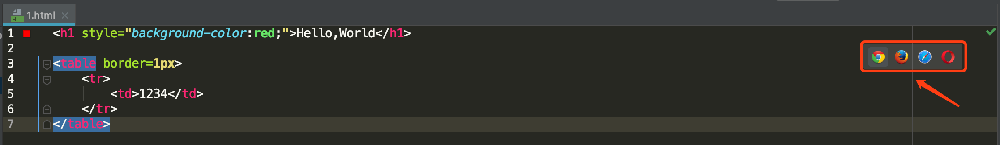
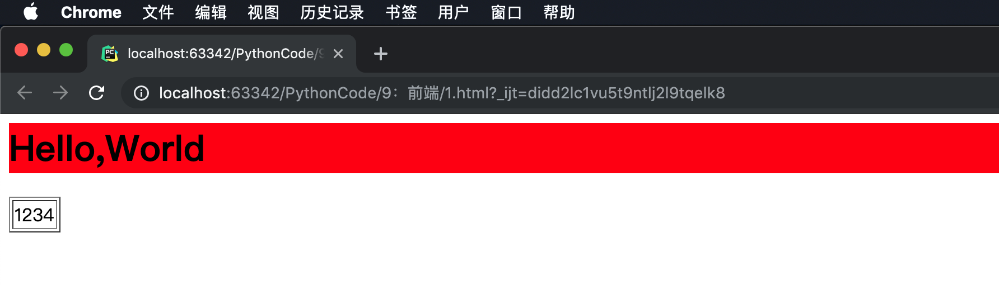

## 二、前端页面的打开方式

### 1、前端页面两种打开方式

- 通过pycharm打开
- 通过文件直接打开

### 2、通过Pycharm打开前端页面

①、敲入示例html

```html
<h1 style="background-color:red;">Hello,World</h1>

<table border=1px>
    <tr>
        <td>1234</td>
    </tr>
</table>
```

②、pycharm打开





> pycharm会在本地直接启动一个类似于`socker server`的进程，调用浏览器直接访问

### 3、通过文件直接打开

略 