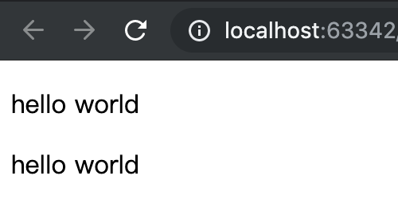
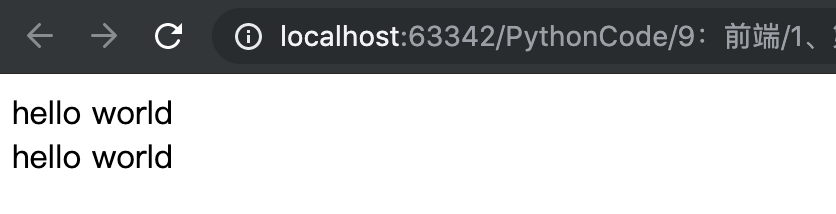
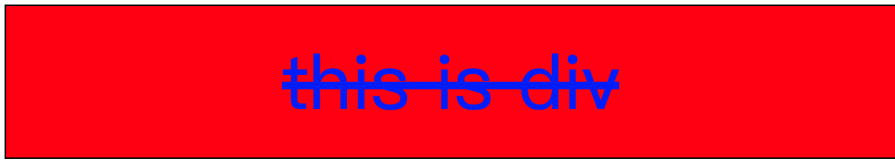
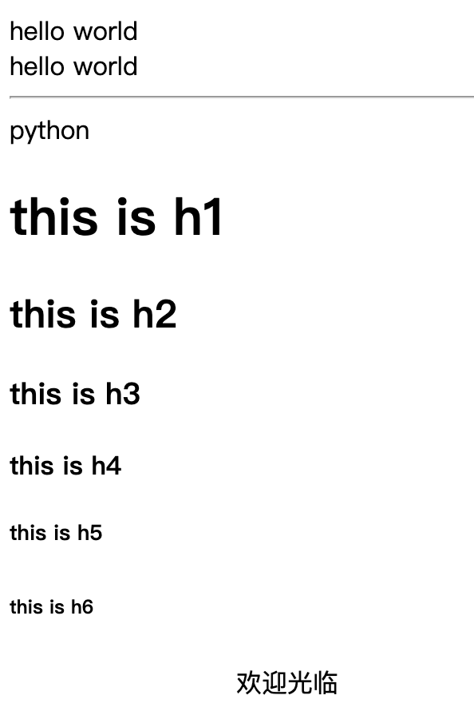

## 三、HTML结构

### 1、HTML组成详解

- 标签
- 指令
- 实体

### 2、整体的结构

```html
├── <!DOCTYPE html>     <!使用HTML5作为解释器>
└── <html>
    ├── <head>          <!头部描述信息>
    │   ├── <meta>
    │   ├── <title>
    │   ├── <base>
    │   ├── <link>
    │   ├── <style>
    │   └── <script>
    └── <body>          <!真实的内容>
```

### 3、标签的分类

- 单闭合标签：如`<meta charset='UTF-8'>`
- 双闭合标签：如`<title>Title</title>`

### 4、html常用标签之字体以及排版标签

①、排版元素

|          标签           |                             作用                             |
| :---------------------: | :----------------------------------------------------------: |
|        `<p></p>`        |       用来创建一个段落，该元素自动在其前后创建一些空白       |
|         `<br/>`         |                             换行                             |
|         `<hr/>`         |                         华丽的分割线                         |
| `<h1></h1>...<h6></h6>` | 6种标题效果标签。分别为h1~h6。`<h1>`字体最大，`<h6>`字体最小 |

示例1：段落标签

```html
<!DOCTYPE html>
<html lang="en">
<head>
    <meta charset="UTF-8">
    <title>第一个页面</title>
</head>
<body>
<p>hello world</p>hello world
</body>
</html>
```

效果：自动在其前后创建一些空白



示例2：换行标签

```html
<!DOCTYPE html>
<html lang="en">
<head>
    <meta charset="UTF-8">
    <title>第一个页面</title>
</head>
<body>
hello world<br/>hello world
</body>
</html>
```

效果：换行



示例三、分割线

```html
<!DOCTYPE html>
<html lang="en">
<head>
    <meta charset="UTF-8">
    <title>第一个页面</title>
</head>
<body>
hello world<br/>hello world
<hr/>
python
</body>
</html>
```
效果：分割线


示例4：标题标签

```html
<!DOCTYPE html>
<html lang="en">
<head>
    <meta charset="UTF-8">
    <title>第一个页面</title>
</head>
<body>
hello world<br/>hello world
<hr/>
python
<h1>this is h1</h1>
<h2>this is h2</h2>
<h3>this is h3</h3>
<h4>this is h4</h4>
<h5>this is h5</h5>
<h6>this is h6</h6>
</body>
</html>
```

效果：不同级别的标签


示例5：跑马灯效果

```html
<!DOCTYPE html>
<html lang="en">
<head>
    <meta charset="UTF-8">
    <title>第一个页面</title>
</head>
<body>
hello world<br/>hello world
<hr/>
python
<h1>this is h1</h1>
<h2>this is h2</h2>
<h3>this is h3</h3>
<h4>this is h4</h4>
<h5>this is h5</h5>
<h6>this is h6</h6>
<marquee behavior="" direction="right">欢迎光临</marquee>
</body>
</html>
```

效果：循环移动字幕



