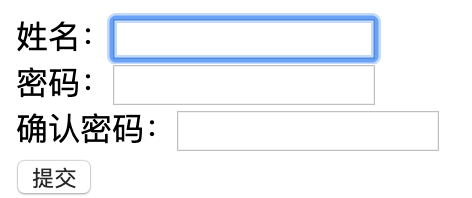

## 三、HTML结构

### 1、HTML常用标签概述

- 字体以及排版标签
- 列表标签
- 跳转标签
- div和span标签
- img标签

### 2、字体以及排版标签

①、排版元素

|          标签           |                             作用                             |
| :---------------------: | :----------------------------------------------------------: |
|        `<p></p>`        |       用来创建一个段落，该元素自动在其前后创建一些空白       |
|         `<br/>`         |                             换行                             |
|         `<hr/>`         |                         华丽的分割线                         |
| `<h1></h1>...<h6></h6>` | 6种标题效果标签。分别为h1~h6。`<h1>`字体最大，`<h6>`字体最小 |

示例1：段落标签

```html
<!DOCTYPE html>
<html lang="en">
<head>
    <meta charset="UTF-8">
    <title>第一个页面</title>
</head>
<body>
<p>hello world</p>hello world
</body>
</html>
```

效果：自动在其前后创建一些空白


示例2：换行标签

```html
<!DOCTYPE html>
<html lang="en">
<head>
    <meta charset="UTF-8">
    <title>第一个页面</title>
</head>
<body>
hello world<br/>hello world
</body>
</html>
```

效果：换行


示例三、分割线

```html
<!DOCTYPE html>
<html lang="en">
<head>
    <meta charset="UTF-8">
    <title>第一个页面</title>
</head>
<body>
hello world<br/>hello world
<hr/>
python
</body>
</html>
```

效果：分割线


示例4：标题标签

```html
<!DOCTYPE html>
<html lang="en">
<head>
    <meta charset="UTF-8">
    <title>第一个页面</title>
</head>
<body>
hello world<br/>hello world
<hr/>
python
<h1>this is h1</h1>
<h2>this is h2</h2>
<h3>this is h3</h3>
<h4>this is h4</h4>
<h5>this is h5</h5>
<h6>this is h6</h6>
</body>
</html>
```

效果：不同级别的标签    


示例5：跑马灯效果

```html
<!DOCTYPE html>
<html lang="en">
<head>
    <meta charset="UTF-8">
    <title>第一个页面</title>
</head>
<body>
hello world<br/>hello world
<hr/>
python
<h1>this is h1</h1>
<h2>this is h2</h2>
<h3>this is h3</h3>
<h4>this is h4</h4>
<h5>this is h5</h5>
<h6>this is h6</h6>
<marquee behavior="" direction="right">欢迎光临</marquee>
</body>
</html>
```

效果：循环移动字幕


### 3、列表标签

示例1：无序标签

**常用属性**

type属性：disc(实心圆点)(默认)、circle(空心圆圈)、square(实心方块)

```html
<ul>
    <li>123</li>
    <li>456</li>
</ul>
<ul type="circle">
    <li>123</li>
    <li>456</li>
</ul>
```

效果：无序标签


示例2：有序列表

属性：type编号类型，默认为整数。可选（1、A、a、Ⅰ、i）
属性：start起始编号，默认为1，即由最小编号开始

```html
<ol>
    <li>123</li>
    <li>456</li>
</ol>
<ol type="A">
    <li>123</li>
    <li>456</li>
</ol>
```

效果：有序标签


### 4、a标签

语法：`<a 属性=“属性值”>标签内容</a>`

常见属性：

- href – 指定目标网页的地址，该地址可以有如下类型
  - 链接远程目标：通过URL地址链接到远程目标
  - 链接本地页面：可以通过相对路径或者绝对路径链接本地页面
- target
  - _blank表示在新窗口中打开目标网页
  - _self表示在当前窗口中打开目标网页 

示例1：网页跳转

```html
<a href="https://www.baidu.com">跳转到百度</a>
```

示例2：跳转到本地静态资源

```html
<a href="./1.html">跳转到本地静态资源</a>
```

示例3：跳转到本地静态资源，且新建浏览器标签打开

```html
<a href="./1.html" target="_blank">跳转到本地静态资源</a>
```

示例4：链接到邮箱

```html
<a href=“mailto:szk5043@foxmail.com”>给我发邮件</a>
```

示例5：下载文件

```html
<a href=“/download/winRAR.rar”>下载WinRAR</a>
```

### 5、div和span标签

`<div>`只是一个块级标签(独占一行)，并无实际的意义. 主要通过CSS为其赋予不同的表现
`<span>`内联行标签(行内元素),并无实际的意义. 主要通过CSS为其赋予不同的表现

> **块级元素与行内元素的区别:**所谓块元素，是以另起一行开始渲染的元素，行内元素则不需另起一行

### 6、img标签

**语法：**

``

**常见的属性用法说明：**

|  属性  |   值    |        含义        |
| :----: | :-----: | :----------------: |
|  src   | 图像URL |   规定图像的URL    |
|  alt   | 字符串  | 规定图像的替代文本 |
| width  | px / %  |    规定图像的宽    |
| height | px / %  |    规定图像的高    |
| border |   px    |   图像的边框粗细   |

示例1：加载本地图片

```html

```

示例2：加载网络图片

```html

```

示例3：指定显示图片的大小

```html

```

### 7、表格标签

语法：

```html
<table>
    <tr>
        <th>标题</th>
        <th>标题</th>
    </tr>
    <tr>
        <td>内容</td>
        <td>内容</td>
     </tr>
</table>
```

解释说明：

- `<table></table>`表示的表格的开始和结束
- `<tr></tr>`表示的是表格的一行
- `<td></td>`表示的是一个单元数据格
- `<th></th>`表示表格标题单元格，且加粗居中显示

常用属性：

|  属性  |        值         |       含义       |
| :----: | :---------------: | :--------------: |
| width  |       px或%       |    表格的宽度    |
| height |       px或%       |    表格的高度    |
| border |        px         | 表格的边框的粗细 |
| align  | Left/center/right |  元素的对齐方式  |

示例1：一个简单的表格

```html
<table border="1px" width="200px" height="100px" align="center">   <!--指定表格边框、高和宽像素-->
  <thead align="center">          <!--表头，align="center"文字居中显示-->
    <tr>         <!--一行数据-->
      <td>ID</td>           <!--单元格，写具体内容-->
      <td>name</td>
      <td>age</td>
    </tr>
  </thead>
  <tbody align="center">          <!--表格体-->
    <tr>
      <td>1</td>
      <td>wesley</td>
      <td>18</td>
    </tr>
  </tbody>
```

示例2：一个相对简单的表格

```html

```

### 8、form表单元素标签

①、基本概念：

HTML表单是HTML元素中较为复杂的部分，表单往往和脚本、动态页面、数据处理等功能相结合，因此它是制作动态网站很重要的内容。

表单一般用来收集用户的输入信息

②、表单的工作原理

访问者在浏览有表单的网页时，可填写必需的信息，然后按某个按钮提交
这些信息通过Internet传送到服务器上
服务器上专门的程序对这些数据进行处理，如果有错误会返回错误信息，并要求纠正错误

示例1：一个简单的输入框

```html
<form action="http://127.0.0.1:8888/index" method="post"
    姓名: <input type="text"><br>
    密码: <input type="password"><br>
    确认密码: <input type="password"><br>
    <input type="submit" value="提交">
</form>
```

效果：



常见的INPUT标签：

| type属性值 |    空间名称    |                   对应代码                   |
| :--------: | :------------: | :------------------------------------------: |
|    text    | 单行文本输入框 |            `<input type="text"/>`            |
|  password  |   密码输入框   |          `<input type="password"/>`          |
|  checkbox  |     复选框     | `<input type="checkbox" checked='checked'/>` |
|   radio    |     单选框     |           `<input type="radio"/>`            |
|   submit   |    提交按钮    |    `<input type="submit" value='提交'/>`     |
|   reset    |    重置按钮    |     `<input type="reset" value='重置'/>`     |
|   button   |    普通按钮    |  `<input type="button" value=“普通按钮”/>`   |
|   hidden   |    隐藏按钮    |  `<input type="hidden" value=“隐藏按钮”/>`   |
|    file    |   文本选择框   |            `<input type="file"/>`            |