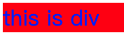
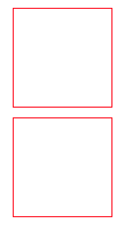
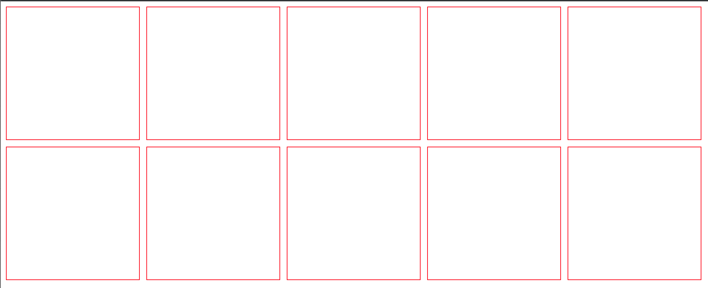

## 四、CSS

### 1、CSS基本概念

①、css是什么？

CSS指的是**层叠样式表(Cascading Style Sheets)** 

②、css有什么用

用于定义如何显示HTML元素

③、css的优点

- 使网页代码更少，网页下载更快
- 实现来了内容与样式的分离，使网站维护更快捷
- 使网页与浏览器的兼容性更好

④、css的语言结构

每个CSS样式由两个组成部分：选择器和声明。声明又包括属性和属性值。每个声明之后用分号结束


> css中，选择器很重要，它制定了对哪些元素进行样式设置

### 2、网页布局的三种方法

①、行内样式

它是所有样式方法中最为直接的一种，它直接对HTML的标签使用style属性，
然后将css代码直接写在其中。

```html
<p style="color: aqua;font-size:300px;">hello world</p>
```

②、内部样式

在HTML文档头部< head >区域使用 < style > 标签来包含CSS

```html
<style type="text/css">
  p{
    color: red;
    font-size: 100px;
  }
</style>

<p>hello world</p>
```

③、外部样式

外部样式就是将css写在一个单独的文件中，然后在页面进行引入即可

1.css

```css
 p{
    color: yellow;
    font-size: 100px;
}
```

```html
<link rel="stylesheet" type="text/css" href="1.css">
<p>hello world</p>
```

### 3、标签选择器

CSS规则由两个主要的部分构成：选择器，以及一条或多条声明，如下：

```
selector {declaration1;declaration2;... declarationN}
```

选择器的种类：

- 标签选择器
- ID选择器：无法重复使用，因为ID无法重复，重复使用请用类别选择器
- 类别选择器
- 通用选择器：只要没有其他样式定义，都会使用这个样式
- 包含选择器
- 分组选择器
- 伪类选择器

选择器的优先级：

- 行内样式 > id选择器 > 类选择器 > 标签选择器 > 通用选择器

示例1：标签选择器

```html
<style>
  h1 {
    color:red;
    font-saze:30px;
  }
</style>

<h1>hello world</h1>
```

示例2：ID选择器

```html
<style>
  #red{
    color: red;
  }
  #green{
    color: green;
  }
</style>

<p id="red">ID选择器1</p>
<p id="green">ID选择器2</p>
```

示例3：类别选择器

```html
<style>
  .red{
    color: red;
  }
  .green{
    color: green;
  }
</style>

<p class="red">类别选择器1</p>
<p class="green">类别选择器2</p>
```

示例4：通用选择器

```html
<style>
  * {
    color:navy;
  }
</style>

<p>hello world</p>
<p>123</p>
```

示例5：包含选择器

```html
<style>
  div p {
    color:red;
  }
</style>

<div>
  in div
  <p>in p</p>
</div>
```

> 被包含的标签才会生效，p标签中的生效

示例6：分组选择器

```html
<style>
  div,span,h1 {
    color:blue;
  }
</style>

<div>in div</div>
<span>in span</span>
<h1>in h1</h1>
```

示例7：选择器的优先级

```html
<style type="text/css">
  #show1{color:gold;}
  .show {color:pink;}
  h1 {color:red;}
  * {color:green;}
</style>

<h1 id="show1" class="show" style="color:gray;">优先级测试</h1>
```

> 行内样式 > id选择器 > 类选择器 > 标签选择器 > 通用选择器

### 4、段落属性和边框以及背景属性

段落属性和边框以及背景属性是用在`div`标签块中的。

比如：设置`div`块中的字体是蓝色，背景为红色

```html
<style>
  div {
    color:blue;            /*设置字体为蓝色*/
    background-color: red;  /*设置背景为红色*/
  }
</style>

<div>this is div</div>
```

效果如下：



①：边框设置之如何给其加上黑色的外边框

```html
<style>
  div {
    color:blue;            /*设置字体为蓝色*/
    background-color: red;  /*设置背景为红色*/
    border-width: 1px ;     /*设置边框像素为1px*/
    border-color: black;    /*设置边框为黑色*/
    border-style: solid;    /*设置边框为实线*/
  }
</style>

<div>this is div</div>
```

更简便的写法

```html
<style>
  div {
    color:blue;            /*设置字体为蓝色*/
    background-color: red;  /*设置背景为红色*/
    border: black 1px solid; /*设置边框为黑色、1个像素、实线*/
  }
</style>

<div>this is div</div>
```

效果如下：


②、文件设置之设置边框像素100，文本50像素、居中对齐、并一条线穿过文本

```html
<style>
  div {
    color:blue;              /*设置字体为蓝色*/
    background-color: red;   /*设置背景为红色*/
    border: black 1px solid; /*设置边框为黑色、1个像素、实线*/
    height: 100px;           /*设置边框高度100px*/
    font-size: 50px;         /*设置字体像素为10*/
    text-align: center;      /*设置字体居中对齐*/
    line-height: 100px;      /*边框像素大于文字时，会导致无法正确居中，需要加上行高,取值和height一样*/
    text-decoration: line-through;  /*一条线穿过文本*/
  }
</style>

<div>this is div</div>
```

效果：


③、图片背景常规设置

```html
<style>
  #myimg {
    background-image: url("https://timgsa.baidu.com/timg?image&quality=80&size=b9999_10000&sec=1562759804992&di=4f1855f1ad4a81def60fc9e46436cd01&imgtype=0&src=http%3A%2F%2Fwww.foshanbdqn.com%2Fuploads%2F170605%2F1-1F605141A3Q0.png");
    width: 100%;    /*设置图片背景的填空比*/
    height: 1000px;  /*设置图片背景的高度*/
    background-repeat: no-repeat;  /* no-repeat 设置不重复填充,repeat-x仅在X轴重复填充，repeat-y仅在Y轴重复填充*/
  }
</style>

<div id="myimg">
  hello world
</div>
```

效果：


④、图片背景设置之动态显示部分图片

当我们的网站流量比较大的时候，我们一般在请求图片资源时，并不是一张一张的去请求，而是一整张的去请求，然后根据需求对图像进行截取，这样的话，能够减少网络的请求，节省大量的费用

```html
<style>
  #myimg{
    width:265px;
    height: 41px;
    background-image: url("http://www.xiaohuar.com/skin/meizi/images/bgtit2_2.png");
    background-repeat: no-repeat;
    background-position-y: -291px;  /*background-position-y图像位置距离浏览器窗口顶部的距离, background-position-x: 图像位置距离浏览器左边的距离*/
  }
</style>

<div id="myimg"></div>
```

效果：


### 5、布局属性

- 外边距：一个`div`和另外一个`div`之间的距离
- 内边距：框中的文字离`div`框的距离

示例1：配置两个`div`的上、左、下外边距为10px

```html
<style>
  .div {
    border: 1px solid red; /*配置div边框像素、实线、红色*/
    width: 200px;        /*配置div宽度像素*/
    height: 200px;       /*配置div高度像素*/
    margin-top: 10px;   /*配置外边距上方像素*/
    margin-left: 10px;  /*配置外边距左方像素*/
    margin-bottom: 10px; /*配置外边距下方像素*/
  }
</style>

<div class="div"></div>
<div class="div"></div>
```

效果：



>  margin : 10px  : 上下左右  都是10px
>  margin : 10px 20px; 上下是10px 左右是20px

示例2：配置框中的文字离框上下左右距离10px

```html
<style>
  .div {
    border: 1px solid red; /*配置div边框像素、实线、红色*/
    width: 100px;        /*配置div宽度像素*/
    height: 100px;       /*配置div高度像素*/
    margin-top: 10px;   /*配置外边距上方像素*/
    margin-left: 10px;  /*配置外边距左方像素*/
    margin-bottom: 10px; /*配置外边距下方像素*/
  }

  #i1 {
    padding-top: 30px;    /*文字距离div顶部的距离*/
    padding-bottom: 30px; /*文字距离div底部的距离*/
    padding-left: 30px;   /*文字距离div左边的距离*/
    padding-right: 30px;  /*文字距离div右部的距离*/
  }
</style>

<div class="div" id="i1">hello world</div>
```

效果：


示例3：去除`div`框之间的留白

```html
*{
  margin: 0;
  padding: 0;
}
```

效果：


示例4：配置div浮动属性

```html
<style>
  .c1{
    border: 1px solid red;  /*设置边框1像素、实线、红色*/
    width:200px;            /*宽*/
    height: 200px;          /*高*/
    float:left;             /*靠左浮动*/
    margin-right: 10px;     /*浮动右边间隔*/
    margin-bottom: 10px;    /*浮动下边间隔*/
  }
</style>

<div class="c1"></div>
<div class="c1"></div>
<div class="c1"></div>
<div class="c1"></div>
<div class="c1"></div>
<div class="c1"></div>
<div class="c1"></div>
<div class="c1"></div>
<div class="c1"></div>
<div class="c1"></div>
```

效果：



示例5：外层div嵌套内层div

```html
<style>
  #i1{
    border: 1px solid green;  /*设置边框1像素、实线、红色*/
    width:900px;
  }
  .c1{
    border:1px solid red;
    width:200px;
    height: 200px;
    float:left;        /*靠左浮动*/
    margin: 10px;     /*浮动上、下、左、右边间隔*/
  }
</style>

<div id="i1">
  <div class="c1"></div>
  <div class="c1"></div>
  <div class="c1"></div>
  <div class="c1"></div>
  <div class="c1"></div>
  <div class="c1"></div>
  <div class="c1"></div>
  <div class="c1"></div>
  <div style="clear:both"></div>          <!--如果内div飘起来, 外div管不住,加此选项-->
</div>
```

效果：


示例6：导航栏

```html
<style>
  *{
    margin: 0;
    padding: 0;
  }
  #header{
    background-color: #dddddd;
    color: white;
    font-size: 15px;
    height: 38px;
    line-height: 38px;
  }
  .login{
    float: left;
  }
  .myright{
    float: right;
  }
  #i1{
    width: 980px;
    margin: 0 auto;
  }
  #i1 a{
    text-decoration: none;
    color: black;
  }
</style>

<div id="header">
  <div id="i1">
    <div class="login">
      <a href="#">登录</a>
    </div>
    <div class="myright">
      <a href="#">我的淘宝</a>
      <a href="#">购物车</a>
      <a href="#">收藏夹</a>
    </div>
    <div style="clear: both;"></div>
  </div>
</div>
```

效果：


示例7：定位属性之头部固定+返回顶部

```html
<style>
  *{
    margin: 0;
    padding: 0;
  }

  #header{
    background-color: bisque;
    height: 38px;
    position: fixed;   /*设置定位属性 fixed：将某个元素固定在页面的某个位置，需要配合位置参数*/
    top:0;
    left:0;
    right: 0;
  }

  #return{
    background-color: blue;
    width: 80px;
    height: 38px;
    position: fixed;
    right:5px;
    bottom: 5px;
  }
  #centent{
    margin-top: 40px;
    height: 1000px;
  }
</style>

<div id="header">这个是header头</div>
<div id="centent">内容</div>
<div id="return">返回顶部</div>
```

效果：


> 参数详解：
>
> - fixed : 将某个元素固定在页面的某个位置，定位方式通常与定位坐标Top，left，right，bottom一起使用
> - absolute :  绝对定位
> - relative：相对定位