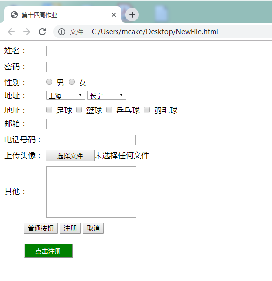

## 练习：

### 1：HTML练习之用户注册

完成下图的用户注册界面



```html
<!DOCTYPE html>
<html lang="en">
<head>
    <meta charset="UTF-8">
    <title>用户注册</title>
</head>
<body>
    <table>
        <thead>
            <tr>
                <td>用户: </td>
                <td>
                    <input type="text"/>
                </td>
            </tr>
        </thead>
        <tbody>
            <tr>
                <td>密码：</td>
                <td>
                    <input type="password"/>
                </td>
            </tr>
            <tr>
                <td>性别：</td>
                <td>
                    <input type="radio" name="gender"/> 男
                    <input type="radio" name="gender"/> 女
                </td>
            </tr>
            <tr>
                <td>地址：</td>
                <td>
                    <select name="city" id="city">
                        <option value="请选择" selected="selected">请选择</option>
                        <option value="北京">北京</option>
                        <option value="上海">上海</option>
                        <option value="广州">广州</option>
                        <option value="深圳">深圳</option>
                        <option value="杭州">杭州</option>
                    </select>
                    <select name="zone" id="zone">
                        <option value="请选择" selected="selected">请选择</option>
                        <option value="长宁">长宁</option>
                        <option value="静安">静安</option>
                        <option value="虹口">虹口</option>
                        <option value="杨浦">杨浦</option>
                        <option value="宝山">宝山</option>
                    </select>
                </td>
            </tr>
            <tr>
                <td>爱好：</td>
                <td>
                    <input type="checkbox" name='hobby'/> 足球
                    <input type="checkbox" name='hobby'/> 篮球
                    <input type="checkbox" name='hobby'/> 乒乓球
                    <input type="checkbox" name='hobby'/> 羽毛球
                </td>
            </tr>
            <tr>
                <td>邮箱：</td>
                <td>
                    <input type="text"><br>
                </td>
            </tr>
            <tr>
                <td>电话号码：</td>
                <td>
                    <input type="text"><br>
                </td>
            </tr>
            <tr>
                <td>上传头像：</td>
                <td>
                    <input type="file"><br>
                </td>
            </tr>
            <tr>
                <td height="150" align="left">其他：</td>
                <td>
                    <textarea id="text1" style="width: 200px;height: 100px;"> </textarea>
                </td>
            </tr>
            <tr>
                <td>
                    <input type="button" value="普通按钮">
                    <input type="submit" value="注册按钮">
                    <input type="reset" value="取消按钮">
                </td>
            </tr>
        </tbody>
    </table>
</body>
</html>
```


### 2、CSS练习之网页布局


```html
<!DOCTYPE html>
<html lang="en">
<head>
    <meta charset="UTF-8">
    <title>页面布局</title>
    <style>
        /*去除留白*/
        *{
            margin: 0;
            padding: 0;
        }

        /*上边定位*/
        #header {
            background-color: blue;
            height: 40px;
            position: fixed;
            top:0;
            left: 0;
            right: 0;
        }

        /*左边定位*/
        #left {
            background-color: green;
            width: 100px;
            position: fixed;
            top:40px;
            left: 0;
            bottom: 0;
        }

        /*内容*/
        #centent {
            background-color: #dddddd;
            margin-top: 40px;
            margin-left: 100px;
            height: 1000px;
        }

    </style>
</head>
<body>
    <div id="header">头部内容</div>
    <div id="left">左边内容</div>
    <div id="centent">
        123 <br>
        123 <br>
        123 <br>
        123 <br>
        123 <br>
        123 <br>
        123 <br>
        123 <br>
        123 <br>
        123 <br>
    </div>
</body>
</html>
```

3、CSS练习之限时抢购


```html
<!DOCTYPE html>
<html lang="en">
<head>
    <meta charset="UTF-8">
    <title>限时抢购</title>
    <style>

        /*最外层div*/
        #l1{
            width: auto;
            height: auto;
            border: 1px solid orange;
        }

        /*标题div*/
        h2{
            color: orange;
            font-size: 18px;
            margin-top: 0;
            padding-left: 15px;
        }

        /*商品div*/
        .item{
            width: 250px;
            height: 270px;
            border: 1px solid #e7e7e7;
            float: left;
            margin: 11px;
            position: relative;
        }

         /*图片*/
        img{
            width: 250px;
            height: 180px;
        }

        /*特价图片*/
        .tejia{
            width: 200px;
            height: 100px;
        }

        /*现价*/
        .current{
            color: red;
            font-size: 16px;
            margin-left: 32px;
        }

        /*原价*/
        .origin{
            text-decoration: line-through;
            margin-left: 20px;
        }
    </style>
</head>
<body>
    <div id="l1">
        <h2>限时抢购</h2>
        <div class="item">
            
            
            <p>苹果特价</p>
            <div>
                <span class="current">&yen;250</span><span class="origin">&yen;49998</span>
            </div>
        </div>

        <div class="item">
            
            
            <p>苹果特价</p>
            <div>
                <span class="current">&yen;250</span><span class="origin">&yen;19998</span>
            </div>
        </div>

        <div class="item">
            
            
            <p>苹果特价</p>
            <div>
                <span class="current">&yen;250</span><span class="origin">&yen;9988</span>
            </div>
        </div>

        <div class="item">
            
            
            <p>苹果特价</p>
            <div>
                <span class="current">&yen;250</span><span class="origin">&yen;9988</span>
            </div>
        </div>

        <div class="item">
            
            
            <p>苹果特价</p>
            <div>
                <span class="current">&yen;250</span><span class="origin">&yen;7998</span>
            </div>
        </div>

        <div class="item">
            
            
            <p>苹果特价</p>
            <div>
                <span class="current">&yen;250</span><span class="origin">&yen;5998</span>
            </div>
        </div>

        <div class="item">
            
            
            <p>苹果特价</p>
            <div>
                <span class="current">&yen;250</span><span class="origin">&yen;4998</span>
            </div>
        </div>

        <div class="item">
            
            
            <p>苹果特价</p>
            <div>
                <span class="current">&yen;250</span><span class="origin">&yen;3998</span>
            </div>
        </div>
    </div>

</body>
</html>
```

