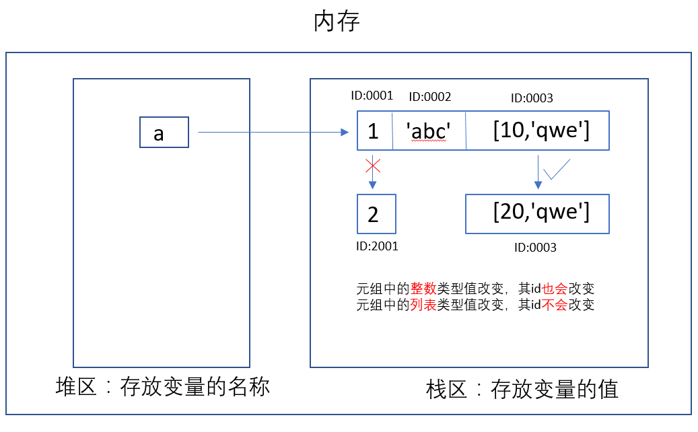

# 可变和不可变类型
#### Python六种标准数据类型中的可变和不可变类型：

-  不可变数据类型：Number、String、Tuple
-  可变数据类型：List、Dictionary、Set

#### 可变和不可变类型区别在哪里？

- 不可变类型：值改变，id一定改变
- 可变类型：值改变，id不变

##### 示例一：更改数字类型的值，id也随之改变

```python
a = 1
print(a,id(a))
a = 2
print(a,id(a))

'''
返回值：
1 140725582816080
2 140725582816112
'''
```

> 上面代码可见，a重新赋值，a的id值也随之改变

##### 示例二：更改列表的值，id不变

```py
b = [1]
print(b,id(b))
b[0] = 2
print(b,id(b))

'''
返回值：
[1] 3217966484552
[2] 3217966484552
'''
```

> 上面代码可见，修改列表b的值，b的id不改变。

#### 元组中的值到底可不可以改变

##### 示例1：元组内的值无法修改

```python
t6 = (1,'abc',[10,'qwe'])
print(t6,type(t6))
t6[0] = 2
print(t6,type(t6))

'''
返回值：
(1, 'abc', [10, 'qwe']) <class 'tuple'>
TypeError: 'tuple' object does not support item assignment
'''
```

##### 示例2：元组内的可变值可以修改

```python
t6 = (1,'abc',[10,'qwe'])
print(t6,id(t6))
t6[2][0] = 20
print(t6,id(t6))

'''
返回值：
(1, 'abc', [10, 'qwe']) 1887690720456
(1, 'abc', [20, 'qwe']) 1887690720456
'''
```

> 注：元组中存放了可变类型数据，可以发生形式上的值该表，本质值未发生改变

***图解：***
  

- 若元组中的整数类型，发生值改变，id也会随之改变，因元组的值发生改变，就会报错。
- 若元组中的列表类型，发生值改变，id不会改变，元组的值不会改变。

