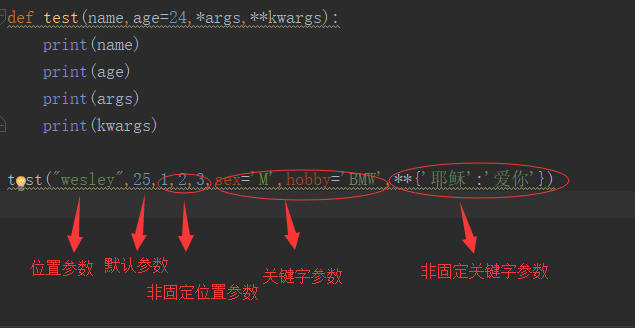

## 二、函数参数的使用

#### 1、函数参数的概述

常用的函数的参数分为以下几种：

- 默认参数
- 位置参数
- 关键字参数
- 参数组
	- 非固定位置参数
	- 非固定关键字参数

#### 2、函数参数定义

在此之前，我们演示的函数都是没有带参数的，下面我们来说说带参数的函数：

- 形参：指的是形式参数，是虚拟的，不占用内容空间；形参单元只有被调用时才分配内存单元

- 实参：指的是实际参数，是一个变量，占用内存空间；数据传递单向，**实参可以传给形参，形参不能传给实参**

##### 示例1：函数参数的定义

```python
def test(x,y):     #x,y是形参
    print(x)
    print(y)
    
test(1,2)      #1,2是实参

'''
返回值：
1
2
'''
```

> 上述可知：函数定义时的参数是形参，函数调用时的参数的是实参

#### 3、默认参数

我们在传参之前，选给参数指定一个默认的值。**默认参数特点是非必须传递的。**

**默认参数用途：**

- 安装默认软件（def test(x,soft=True)）
- 传递默认参数值（定义Mysql的默认端口号：def count(host.port=3306)）

```python
def test(x,y=2):
    print(x)
    print(y)
 
print("------没有给默认参数传值------")
test(1)
print("------给默认参数传位置参数------")
test(1,3)
print("------给默认参数传关键字参数------")
test(1,y=3)

'''
#返回值：
------没有给默认参数传值------
1
2
------给默认参数传位置参数------
1
3
------给默认参数传关键字参数------
1
3
'''
```

#### 4、位置参数

实际参数和形式参数是一一对应的。如果调换位置，x和y的返回值也会调换

##### 示例1：参数互换

```python 
def test(x,y):
    print(x)
    print(y)
 
print('-----互换前-----')
test(1,2)
print('-----互换后-----')
test(2,1)

'''
返回值：
-----互换前-----
1
2
-----互换后-----
2
1
'''
```

> 上述可知，参数互换，值也互换。
>
> 那如果多一个或者少一个参数呢？

##### 示例2：多一个参数

```python
def test(x,y):
    print(x)
    print(y)
 
print("------多一个参数------")
test(1,2,3)

'''
#返回值
Traceback (most recent call last):
------多一个参数------
  File "E:/python/day3/func_test5.py", line 11, in <module>
    test(1,2,3)
TypeError: test() takes 2 positional arguments but 3 were given
'''
```

##### 示例3：少一个参数

```python
def test(x,y):
    print(x)
    print(y)
 
print("------少一个参数------")
test(1)

'''
#返回值
------少一个参数------
Traceback (most recent call last):
  File "E:/python/day3/func_test5.py", line 11, in <module>
    test(1)
TypeError: test() missing 1 required positional argument: 'y'
'''
```

> 上述可知：位置参数，多传一个或者少传一个参数都是不行的

#### 5、关键字参数

位置参数有些缺点，如果位置搞错，那么返回值也会搞错。所以衍生出关键字传参。**关键字传参不需要一一对应**，只需要指定哪个形参调用哪一个实参即可。

##### 示例1：关键字参数

```python 
def test(x, y):
    print(x)
    print(y)
 
print("--------互换前------")
test(x=1, y=2)
print("--------互换后------")
test(y=2, x=1)

'''
#返回值
--------互换前------
1
2
--------互换后------
1
2
'''
```

> 事儿妈来了，位置参数和关键字参数是否可以混着用？

##### 示例2：位置参数在前，关键字参数在后

```python
def test(x, y):
    print(x)
    print(y)
 
test(1, y=2)

'''
#返回值
1
2
'''
```

这样是可以的，可以试试关键字不传给y，传给x

```python
def test(x, y):
    print(x)
    print(y)
 
test(1,x=2)

'''
#返回值
Traceback (most recent call last):
  File "E:/python/day3/func_test5.py", line 10, in <module>
    test(1,x=2)
TypeError: test() got multiple values for argument 'x'
'''
```

> 注：报错因形参x传的值过多。因为实参1已经传给了形参x，后面的x=2有传给了x

##### 示例3：关键字在前，位置参数在后

```python
def test(x, y):
    print(x)
    print(y)
 
test(x=1,2)

'''
#返回值
 File "E:/python/day3/func_test5.py", line 10
    test(x=1,2)
            ^
SyntaxError: positional argument follows keyword argument
'''
```

位置没错，为什么位置参数放在前面不行呢，放在中间试试

```python
def test(x,y,z):
    print(x)
    print(y)
    print(z)
 
test(1,y=2,3)

'''
#返回值
 File "E:/python/day3/func_test5.py", line 10
    test(1,y=2,3)
              ^
SyntaxError: positional argument follows keyword argument
'''
```

还是报错，关键字参数放在最后试试

```python
def test(x,y,z):
    print(x)
    print(y)
    print(z)
 
test(1,2,z=3)

'''
#返回值
1
2
3
'''
```

那最后用两个关键字参数呢

```python
def test(x,y,z):
    print(x)
    print(y)
    print(z)
 
test(1,y=2,z=3)

'''
#返回值
1
2
3
'''
```

> 小结：关键字参数是不能写在位置参数前面的

#### 6、参数组

之前我们传参数，都是传一个固定参数，不能多也不能少，但是如果说我们需要非固定参数怎么办呢？于是衍生出了，一下以下两种传参方式：

- *args：非固定位置参数传参，接收N个位置参数，转换成**元组**的方式
- \**kwargs：非固定关键字传参，接收N个位置参数，转换成**字典**的方式

#### a、非固定位置参数传参

##### 示例1：非固定位置参数可传参类型

```python
def test(*args):        #非固定位置参数传参，形参必须以*开头，args参数名可自定义，args为规范
    print(args)
 
print("------不传入任何值------")
test()
print("------传入多个位置参数------")
test(1,2,3,4,5)
print("------传入列表------")
test([1,2,3,4,5])
print("------传入列表前加*------")
test(*[1,2,3,4,5])

'''
#返回值
------不传入任何值------
()                                     #什么都不输入，输出空元组
------传入位置参数------
(1, 2, 3, 4, 5)                        #输入多个位置参数，输出元组
------传入列表------
([1, 2, 3, 4, 5],)                     #输入列表，输出元组中的一个元素
------传入列表前加*------
(1, 2, 3, 4, 5)                        #输入列表前加*，输入元组
'''
```

> 上述可知：
>
> - 什么都不输入，输出空元组
> - 输入多个位置参数，输出元组
> - 输入列表，输出元组中的一个元素
> - 输入列表前加*，输入元组

##### 示例2：位置参数和非固定位置参数混用

```python
def test(x,*args):
    print(x)           #位置参数
    print(args)      #非固定参数
 
test(1,2,3,4,5)

'''
#返回值
1
(2, 3, 4, 5)
'''
```

> 从上面看出，第一个参数，被当做位置参数，剩下的被当做非固定位置参数

##### 示例3：关键字参数和非固定位置参数混用

```python
def test(x,*args):
    print(x)
    print(args)
 
test(x=1,2,3,4,5)

'''
#返回值
Traceback (most recent call last):
  File "E:/python/day3/func_test7.py", line 25, in <module>
    test(1,2,3,4,x=5)
TypeError: test() got multiple values for argument 'x'   
'''
```

> 很显然报错，因为x=1是关键字参数，*args是位置参数，而**关键字参数不能在位置参数前面**，所以报错

##### b、非固定关键字参数传参

##### 示例1：非固定关键字参数传参类型

```python
def test(**kwargs):
    print(kwargs)
 
print("------不传入任何值------")
test()
print("------传入多个关键字参数------")
test(name='wesley', age=24)
print("------传入字典------")
test(**{'name': 'wesley','age': 24})  # 传入字典时，一定要在字典前面加**，否则就会报错

'''
#返回值
------不传入任何值------
{}
------传入多个关键字参数------
{'name': 'wesley', 'age': 24}
------传入字典------
{'name': 'wesley', 'age': 24}
'''
```

> 上述可知：
>
> - 不传入值：返回空字典
> - 传入多个值：返回字典
> - 传入字典：返回字典

然而，为什么传入字典需要加**，不加会如何

```python
def test(**kwargs):
    print(kwargs)
 
test({'name':'wesley','age':24})

'''
#返回值：
Traceback (most recent call last):
  File "E:/python/day3/funx_test6.py", line 9, in <module>
    test({'name':'wesley','age':24})
TypeError: test() takes 0 positional arguments but 1 was given
'''
```

> 因为传入的字典被当做位置参数，所以报类型错诶，所以千万要记住：**传字典，加\*\***

##### 示例2：位置参数和非固定关键字参数混用

```python
def test(name,**kwargs):
    print(name)
    print(kwargs)
 
print("-------1个位置参数--------")
test("wesley")
print("-------1个位置参数,两个关键字参数--------")
test("wesley",age=24,sex='M')
print("--------3个关键字参数--------")
test(name="wesley",age=24,sex='M')

'''
#返回值
wesley
{}                    
-------1个位置参数,两个关键字参数--------
wesley
{'age': 24, 'sex': 'M'}
--------3个关键字参数--------
wesley
{'age': 24, 'sex': 'M'}
'''
```

##### 示例3：位置参数、关键字参数和非固定关键字参数混合

```python
def test(name,age=24,**kwargs):
    print(name)
    print(age)
    print(kwargs)          #参数组一定要放在最后
 
print("-------age默认参数--------")
test("wesley",sex='M',hobby='BMW')
print("-------age位置参数--------")
test("wesley",24,sex='M',hobby='BMW')
print("-------age关键字参数--------")
test(name="wesley",sex='M',hobby='BMW',age=24)    #age关键字参数，放在前后没有影响

'''
#返回值
-------age默认参数--------
wesley
24
{'sex': 'M', 'hobby': 'BMW'}
-------age位置参数--------
wesley
24
{'sex': 'M', 'hobby': 'BMW'}
-------age关键字参数--------
wesley
24
{'sex': 'M', 'hobby': 'BMW'}
'''
```

>  如果遇到一个关键字传参和非固定关键字，前后方的位置是不影响传参的，但是我们一般还是按顺序来。

##### 示例4：位置参数、关键字参数、固定位置参数和非固定关键字参数

```python
def test(name,age=24,*args,**kwargs):
    print(name)
    print(age)
    print(args)
    print(kwargs)
 
print("-------位置参数、非固定位置参数、非固定关键字参数--------")
test("wesley",1,2,3,sex='M',hobby='BMW')
print("-------位置参数、非固定位置参数、非固定关键字参数--------")
test("wesley",24,*[1,2,3],**{'sex':'M','hobby':'BMW'})

'''
#返回值
-------位置参数、关键字参数、非固定位置参数、非固定关键字参数--------
wesley         #name位置参数
1                  #age位置参数
(2, 3)           #非固定位置参数，已转成成元组
{'hobby': 'BMW', 'sex': 'M'}           #非固定关键字参数，已转换成字典
-------位置参数、非固定位置参数、非固定关键字参数--------
wesley
24 
(1, 2, 3)                #以列表的方式传入，列表前面加*
{'hobby': 'BMW', 'sex': 'M'}          #以字典的方式传入，字典前面加**
'''
```

上面的age传参传的是位置参数，那能否传入关键字参数呢？

```python
def test(name,age=24,*args,**kwargs):
    print(name)
    print(age)
    print(args)
    print(kwargs)
 
test("wesley",age=25,1,2,3,sex='M',hobby='BMW')

'''
#返回值
  File "E:/python/day3/func_test7.py", line 13
    test("wesley",age=25,1,2,3,sex='M',hobby='BMW')
                        ^
SyntaxError: positional argument follows keyword argument   #语法错误，位置参数在关键字参数前面
'''
```

> 看来不可以的，为什么？因为age=19是关键字参数，而后面的*args是非固定位置参数，不管*args传入几个字，它的**本质都是位置参数，上面我们提到关键字参数是不能在位置参数前**，所以报错了

看来上面的情况不可以的，那能不能非固定关键字参数在非固定位置参数前面呢？

```python
def test(name,age=24,*args,**kwargs):
    print(name)
    print(age)
    print(args)
    print(kwargs)
 
test("wesley",25,sex='M',hobby='BMW',1,2,3)

'''
#返回值
  File "E:/python/day3/func_test7.py", line 13
    test("wesley",25,sex='M',hobby='BMW',1,2,3)
                                         ^
SyntaxError: positional argument follows keyword argument   #语法错误，关键字参数在位置参数前面
'''
```

> 非固定关键字参数，本质也是关键字参数，是不能放在非固定位置参数的前面

正确的姿势

```python
def test(name,age=24,*args,**kwargs):
    print(name)
    print(age)
    print(args)
    print(kwargs)
 
test("wesley",25,1,2,3,sex='M',hobby='BMW',**{'耶稣':'爱你'})
```


#### 7、函数参数总结

- 参数分为：默认参数、位置参数、关键字参数、非固定位置参数、非固定关键字参数
- 位置参数之前传参，位置不能调换，否则值也会跟着调换；切位置参数多一个或少一个都是不可以的
- **关键字参数是不能放在位置参数前面**，且不用考虑位置的前后问题
- 函数传参的位置依次是：位置参数、默认参数(调用位置参数的值)、非固定位置参数、关键字参数、非固定关键字参数
- 东西说了这么说，用的时候只需要记住def func(*args,**kwargs)

