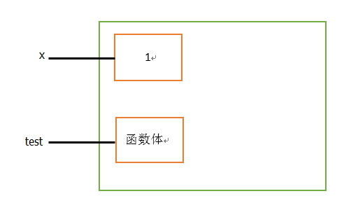
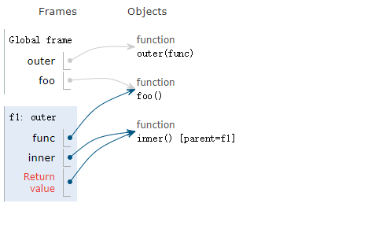
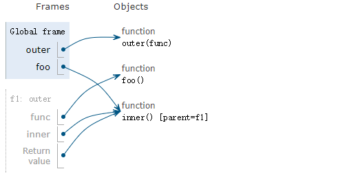

## 八、装饰器

#### 1、概述

装饰器又称语法糖，本质是函数，用来装饰其他函数，顾名思义就是**为其他函数添加其他功能**。

#### 2、装饰器原则

- 不能修改被装饰函数的源代码
- 不能修改被装饰函数的调用方式

装饰器为什么会有这两个原则？因为如果写的程序在生产环境下已经运行了，修改别人的源代码或者别人的调用方式，后果可想而知。

#### 3、实现装饰器的知识储备

- 函数即变量
- 高阶函数
- 嵌套函数

最终：[高阶函数（可点击）](https://github.com/szk5043/python/blob/master/4%EF%BC%9A%E5%87%BD%E6%95%B0/7%EF%BC%9A%E9%AB%98%E9%98%B6%E5%87%BD%E6%95%B0.md)+[嵌套函数（可点击）](https://github.com/szk5043/python/blob/master/4%EF%BC%9A%E5%87%BD%E6%95%B0/4%EF%BC%9A%E5%87%BD%E6%95%B0%E5%AF%B9%E8%B1%A1.md)=>装饰器

#### 4、函数即变量

##### (1)、python的内存机制

```python
x = 1         #变量
  
def test():   #函数
    pass
```

以上一个和一个函数在内存中的表现形式如下图：



​     在python解释器中，有一个概念叫做引用基数，就是比方说，x=1，它会先在内存当中把1这个值实实在在的存放下来，这个x其实就是1的门牌好，也是对1的一次引用。python什么时候把这个1的屋子清空呢？它会等到1所对应的门牌号都没有了，就会把1这里面的东西给清掉，这个也就是python的内存回收机制。

##### (2)、del清理引用基数

   那我们用什么清理呢？用del去清理门牌号，就是对1的值引用的变量，del x表示清理掉1对应的x的门派好。如果x没有del，则x永远不还被删除，除非程序结束了，不然永远不会被删除。del删除的不是1，只是把门牌号x删除了，然后定期刷新时，发现1没有被其他门牌号引用了，才会被真正被清理掉。

#### 5、装饰器

##### 示例1：定义装饰器，统计程序运行的时间

原始程序

```python
def foo():
    time.sleep(3)
    print("in the foo")
 
foo()
```

统计程序运行的时间

```python
import time
 
def outer(func):  
    def inner():
        start_time=time.time()
        func()         
        stop_time=time.time()
        print("the func run thime %s"%(stop_time-start_time))
    return inner   
 
def foo():
    time.sleep(3)
    print("in the foo")
 
foo = outer(foo) 
foo()

'''
#返回值
in the test1
the func run thime 3.000889539718628
'''
```

我没有修改 `foo `函数里面的任何逻辑，只是给` foo `变量重新赋值了，指向了一个新的函数对象。最后调用 `foo()`，不仅能打印日志，业务逻辑也执行完了。现在来分析一下它的执行流程。

这里的 outer 函数其实就是一个装饰器，装饰器是一个带有函数作为参数并返回一个新函数的闭包，本质上装饰器也是函数。outer 函数的返回值是inner 函数，在 inner 函数中，除了执行日志操作，还有业务代码，该函数重新赋值给 foo 变量后，调用 `foo() `就相当于调用` inner()`

foo 重新赋值前：   
    
重新赋值后，foo = outer(foo)     
     
另外，Python为装饰器提供了语法糖 @，它用在函数的定义处：

```python
@outer
def foo():
    time.sleep(3)
    print("in the foo")

foo()
```
这样就省去了手动给foo重新赋值的步骤。
##### 示例2：被装饰的函数带函数

如果被装饰的函数需要传入参数怎么办？

```python
import time
 
def outer(func):  
    def inner():   
        start_time=time.time()
        func()     
        stop_time=time.time()
        print("the func run thime %s"%(stop_time-start_time))
    return inner   
 
@outer
def foo(name,age):
    time.sleep(3)
    print("in the foo")
 
foo('szk',24)

'''
#返回值
Traceback (most recent call last):
  File "E:/python/day4/decorator2.py", line 26, in <module>
    test2('szk',24)
TypeError: inner() takes 0 positional arguments but 2 were given
'''
```

 很显然是错误的。因为这边执行的`foo`函数其实就是执行的`inner`函数，`inner`函数体内的func()其实就是执行`foo`函数。但是，`foo`需要传入name和age两个参数，所以报错。如果在`inner`中传入参数又很麻烦，**不可能为每个需要装饰的函数定义不同的参数**，所以这边需要非固定参数传参。

代码如下：

```python
import time

def outer(func):  
    def inner(*args,**kwargs):   
        start_time=time.time()
        func(*args,**kwargs)     
        stop_time=time.time()
        print("the func run thime %s"%(stop_time-start_time))
    return inner   
 
@outer
def foo(name,age):
    time.sleep(3)
    print(name,"in the foo")
 
foo('szk',24)
'''
#返回值：
szk in the foo
the func run thime 3.000291109085083
'''
```

##### 示例3：被装饰的函数有返回值

如果被调用的函数有返回值，该怎么办呢？

```python
import time

def outer(func):  
    def inner(*args,**kwargs):   
        start_time=time.time()
        res=func(*args,**kwargs)     
        stop_time=time.time()
        print("the func run thime %s"%(stop_time-start_time))
        return res
    return inner   
 
@outer
def foo(name,age):
    time.sleep(3)
    print(name,"in the foo")
    return "from the foo"
    
foo()
'''
#返回值
szk in the foo
the func run thime 3.000291109085083
from the foo
'''
```

##### 示例4：带参数的装饰器

**带参数装饰器的需求**：outer与inner之间要使用外部数据

**解决的方案**：为装饰器加一层闭包，将参数传递进来

```python
# 为什么要出现带参装饰器
def outer(func):
    # outer与inner之间要使用外部数据
    # 可以解决的方案路径，给outer添加参数，但是outer的参数是固定一个，就是被装饰的函数
    def inner(*args, **kwargs):
        res = func(*args, **kwargs)
        return res
    return inner

# 所以只能使用函数的闭包，通过外层函数给内存函数传递参数的方式
def wrap(*arg, **kwargs):
    def outer(func):
        # 就可以使用wrap中的*arg, **kwargs，就是要使用的外部数据
        def inner(*args, **kwargs):
            res = func(*args, **kwargs)
            return res
        return inner
    return outer

a = 10
b = 20
@wrap(a, b)  # @wrap(10, 20) => @outer => fn = outer(fn) => fn = inner
def fn():
    pass
```


[转：Python装饰器为什么难理解？](https://foofish.net/understand-decorator.html)

[转: Python写个带参数的装饰器](https://foofish.net/decorator-with-paramter.html)