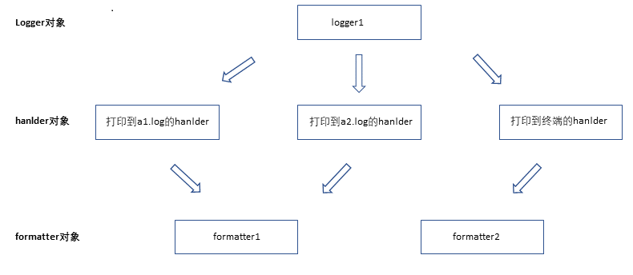

## 六、Loggin日志模块

### 1、概述

很多程序都有记录日志的需求，并且日志中包含的信息即有正常的程序访问日志，还可能有错误，警告等信息输出。

python的logging模块提供了标准的日志接口，你可以通过它存储各种格式的日志，logging的日志可以分为debug，info，warning，error和critical5个级别。

### 2、日志级别

说明：日志级别有五个，分别是：debug，info，warning，error和critical，其中debug级别最低，级别为10，critical级别最高，级别为50，级别越低，打印的日志等级越多。

**常用的日志级别：**

| Level      | When it’s used                                               |
| ---------- | ------------------------------------------------------------ |
| `DEBUG`    | Detailed information, typically of interest only when diagnosing problems. |
| `INFO`     | Confirmation that things are working as expected.            |
| `WARNING`  | An indication that something unexpected happened, or indicative of  some problem in the near future (e.g. ‘disk space low’). The software is  still working as expected. |
| `ERROR`    | Due to a more serious problem, the software has not been able to perform some function. |
| `CRITICAL` | A serious error, indicating that the program itself may be unable to continue running. |

**示例1：打印不同日志级别**

```python
import logging

logging.debug("logging debug")
logging.info("logging info")
logging.warning("user [szk] attempted wrong password more than 3 times")
logging.error("logging error")
logging.critical("logging critical")

'''
返回值：
WARNING:root:user [szk] attempted wrong password more than 3 times
ERROR:root:logging error
CRITICAL:root:logging critical
'''
```

> 默认日志级别为WARNING，只有WARNING及以上的日志都会输入

### 3、日志格式

**farmat的日志格式：**

| %(name)s            | Logger的名字                                                 |
| ------------------- | ------------------------------------------------------------ |
| %(levelno)s         | 数字形式的日志级别                                           |
| %(levelname)s       | 文本形式的日志级别                                           |
| %(pathname)s        | 调用日志输出函数的模块的完整路径名，可能没有                 |
| %(filename)s        | 调用日志输出函数的模块的文件名                               |
| %(module)s          | 调用日志输出函数的模块名                                     |
| %(funcName)s        | 调用日志输出函数的函数名                                     |
| %(lineno)d          | 调用日志输出函数的语句所在的代码行                           |
| %(created)f         | 当前时间，用UNIX标准的表示时间的浮 点数表示                  |
| %(relativeCreated)d | 输出日志信息时的，自Logger创建以 来的毫秒数                  |
| %(asctime)s         | 字符串形式的当前时间。默认格式是 “2003-07-08 16:49:45,896”。逗号后面的是毫秒 |
| %(thread)d          | 线程ID。可能没有                                             |
| %(threadName)s      | 线程名。可能没有                                             |
| %(process)d         | 进程ID。可能没有                                             |
| %(message)s         | 用户输出的消息                                               |

**示例1：将日志写入日志文件**

```python
import logging

logging.basicConfig(filename="catalina.log", level=logging.INFO)  # 输入文件名，和日志级别
# ---日志输出---
logging.debug("logging debug")
logging.info("logging info")
logging.warning("logging warning")

'''
cat catalina.log
INFO:root:logging info
WARNING:root:logging warning
'''
```

> 这句中的level=loggin.INFO意思是，把日志纪录级别设置为INFO，也就是说，只有比日志是INFO或比INFO级别更高的日志才会被纪录到文件里，所以debug日志没有记录，如果想记录，则级别设置成debug也就是level=loggin.DEBUG

**示例2：给日志加入日期格式**

感觉上面的日志格式忘记加上时间啦，日志不知道时间怎么行呢，下面就来加上

```python
import logging

logging.basicConfig(filename='catalina.log',
                    format='%(asctime)s - %(name)s - %(levelname)s -%(module)s:  %(message)s',
                    datefmt='%Y-%m-%d %H:%M:%S %p',
                    level=10)

logging.debug("logging debug")  #10
logging.info("logging info")   #20
logging.warning("user [szk] attempted wrong password more than 3 times")  #30
logging.error("logging error")   #40
logging.critical("logging critical")   #50

'''
cat catalina.log
2019-05-07 15:43:53 PM - root - DEBUG -loggin_test:  logging debug
2019-05-07 15:43:53 PM - root - INFO -loggin_test:  logging info
2019-05-07 15:43:53 PM - root - WARNING -loggin_test:  user [szk] attempted wrong password more than 3 times
2019-05-07 15:43:53 PM - root - ERROR -loggin_test:  logging error
2019-05-07 15:43:53 PM - root - CRITICAL -loggin_test:  logging critical
'''
```

### 4、控制台和文件日志共同输出

在写程序的时候，经常需要终端和日志双向输出。当程序调试完，只输出到文件中。

logging模块提供的几种常用对象：

- logger对象：负责生产各种级别的日志
- filter对象：提供了细度设备来决定输出哪条日志记录
- handler对象：用来控制日志输出的目标，目标可以有多个，如终端和文件
- formmater对象：决定日志记录的最终输出格式

**示例1：输出两个不同文件和终端显示的日志代码**



先上图理解，不同对象之间的关系

```python
import logging

# 1、logger对象：负责生产各种级别的日志
logger1 = logging.getLogger('用户写笔记')

# 2、filter对象：提供了细度设备来决定输出哪条日志记录

# 3、handler对象：用来控制日志输出的目标，目标可以有多个，如终端和文件
fh1 = logging.FileHandler('a1.log',encoding='utf-8')
fh2 = logging.FileHandler('a2.log',encoding='utf-8')
ch = logging.StreamHandler()

# 4、formmater对象
formatter1 = logging.Formatter(
    fmt='%(asctime)s - %(name)s - %(levelname)s -%(module)s:  %(message)s',
    datefmt='%Y-%m-%d %H:%M:%S %p'
)

formatter2 = logging.Formatter(
    fmt='%(asctime)s - %(levelname)s :  %(message)s',
    datefmt='%Y-%m-%d %H:%M:%S %p'
)

# 5、绑定logger对象与handler对象
logger1.addHandler(fh1)
logger1.addHandler(fh2)
logger1.addHandler(ch)

# 6、绑定handler对象与formatter对象
fh1.setFormatter(formatter1)
fh2.setFormatter(formatter1)
ch.setFormatter(formatter2)

# 7、设置日志级别：有logger对象与handler对象两层关卡，必须都放行最终日志才会放行，通常二者级别相同
logger1.setLevel(10)
fh1.setLevel(10)
fh2.setLevel(10)
ch.setLevel(10)

# 8、使用logger对象产生日志
logger1.info('这样写日志，好繁琐，一点都不Pythonist')

'''
终端：
2019-05-08 14:15:29 PM - INFO :  这样写日志，好繁琐，一点都不Pythonist

cat a1.log
2019-05-08 14:15:29 PM - 用户写笔记 - INFO -loggin_test:  这样写日志，好繁琐，一点都不Pythonist

cat a2.log
2019-05-08 14:15:29 PM - 用户写笔记 - INFO -loggin_test:  这样写日志，好繁琐，一点都不Pythonist
'''
```

> 这样写不是很繁琐，我不是应该控制日志内容、日志级别和输出方式就可以了吗？

**示例2：输出两个不同文件和终端显示的日志代码更方便的写法**

日志配置字典:

setting.py

```python
# 日志的格式配置
standard_format = '%(asctime)s - task:%(name)s - %(filename)s:%(lineno)d -' \
                  ' %(levelname)s : [%(message)s]'

simple_format = '%(filename)s:%(lineno)d - %(levelname)s : [%(message)s]'

# 日志文件配置
fh1_path = r'a1.log'
fh2_path = r'a2.log'

# 日志配置字典
LOGGING_DIC = {
    'version': 1,
    'disable_existing_loggers': False,
    'formatters': {
        'standard': {
            'format': standard_format
        },
        'simple': {
            'format': simple_format
        },
    },
    'filters': {},
    'handlers': {
        #打印到终端的日志
        'ch': {
            'level': 'DEBUG',
            'class': 'logging.StreamHandler',  # 打印到终端
            'formatter': 'simple'
        },
        #打印到a1.log文件的日志
        'fh1': {
            'level': 'DEBUG',
            'class': 'logging.FileHandler',  # 保存到文件
            'formatter': 'standard',
            'filename': fh1_path,  # 日志文件的路径
            'encoding': 'utf-8',  # 日志文件的编码，再也不用担心中文log乱码了
        },
        # 打印到a2.log文件的日志
        'fh2': {
            'level': 'DEBUG',
            'class': 'logging.FileHandler',  # 保存到文件
            'formatter': 'simple',
            'filename': fh2_path,  # 日志文件的路径
            'encoding': 'utf-8',  # 日志文件的编码，再也不用担心中文log乱码了
        },

    },
    'loggers': {
        '': {
            'handlers': ['fh1', 'fh2', 'ch'],
            'level': 'DEBUG',
        },
    },
}
```

日志调用文件：

log_run.py

```python
import logging.config
import setting

logging.config.dictConfig(setting.LOGGING_DIC)

logger1 = logging.getLogger('写日志')
# logger1 --> fh1,fh2,ch
logger1.info('这些写日志直接调日志字典就中')

'''
终端：
log_run.py:12 - INFO : [这些写日志直接调日志字典就中]

cat a1.log
2019-05-08 15:05:15,138 - task:写日志 - log_run.py:12 - INFO : [这些写日志直接调日志字典就中]

cat a2.log
log_run.py:12 - INFO : [这些写日志直接调日志字典就中]
'''
```


