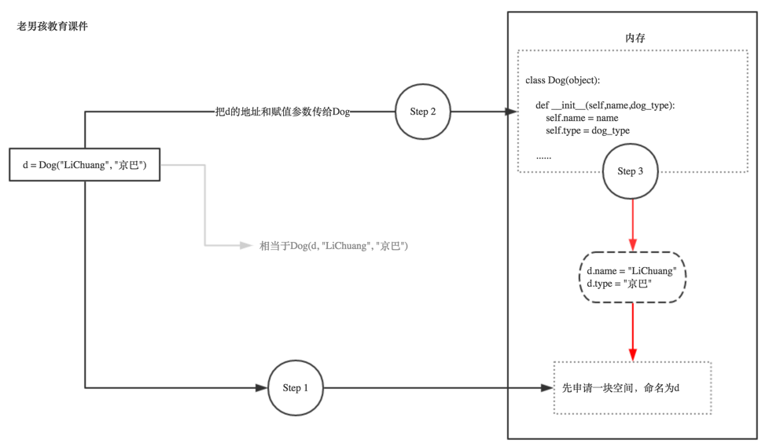

## 二、类的实例化和初始方法

### 1、实例化类

类是一个对象，使用这个类的过程称为**类的实例化**

示例1：写一个类并实例化

```python
class dog(object):             #用class定义类
    "dog class"                #对类的说明
 
    def __init__(self,name):   #构造函数或者是构造方法，也可以叫初始化方法
        self.name = name
 
 
    def sayhi(self):           #类方法
        "sayhi funcation"      #对类方法的说明
        print("hello,i am a dog,my name is ",self.name)
 
 
d = dog("alex")                #定义一个d的对象，叫实例
d.sayhi()                      #调用实例的方法

'''
返回值
hello,i am a dog,my name is  alex
'''
```

**object对象**：表示该类是从哪里类继承下来的。通常没有合适的继承类，就使用object类，这是所有类最终都会继承的类。

**init()初始方法**：`__init__()`是一个特殊的方法，在对象实例化时会被调用。

- 在定义类时，如果不显式的定义一个`__init__()`方法，程序默认调用一个无参的`__init__()`方法
- `__init__()`可以有参数，self为必须默认参数
- 一个类可以定义多个初始方法，但是实例化类只实例化最后的构造方法

**self关键字**：self关键字相当于实例化对象本身（self相当于d），在实例化过程中，把自己传进去

### 2、实例过过程



由上图可知：**其实self,就是实例本身！你实例化时python会自动把这个实例本身通过self参数传进去**。

