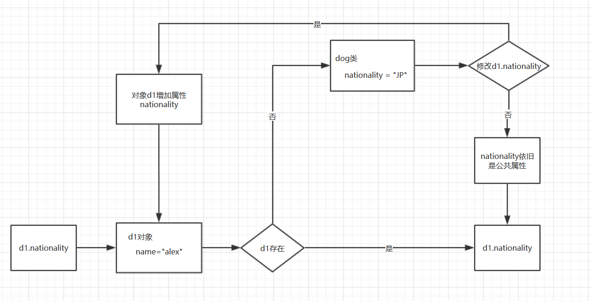

## 三、类的属性

类的属性分为公有属性和私有属性，属性亦可理解为变量。

作用域：

- 公有属性：作用于类和类的实例化对象

- 私有属性：作用于类，类的实例化对象默认不可访问

### 1、公有属性

**示例1：定义类的公有属性**

```python
class dog(object):
    "dog class"
    nationality = "JP"                #定义公有属性nationality
 
    def __init__(self,name):
        self.name = name
 
d1 = dog("alex")                      #实例化类d1
d2 = dog("sanjiang")                  #实例化类d2
print(d1.nationality,d2.nationality)  #所有的成员变量都可以访问

'''
#返回值
JP JP
'''
```

**示例2：类访问和修改公有属性**

```python
class dog(object):
    "dog class"
 
    nationality = "JP"  #定义公有属性
 
    def __init__(self,name):
        self.name = name
 
d1 = dog("alex")
d2 = dog("sanjiang")
print(dog.nationality)  #访问公有属性
dog.nationality = "US"  #修改公有属性
print(dog.nationality)

'''
#输出
JP
US
'''
```

说明：公有属性不仅可以通过所属类的所有对象访问，还可以通过**类本身直接访问和修改**

**示例3：公有属性特性**

说明：公有属性提供所有对象访问和修改，那我们其中有一个对象正在修改公共属性发生什么变化呢？或者类本身直接修改了公共属性，又放生什么变化呢？

```python
class dog(object):
    "dog class"
 
    nationality = "JP"
 
    def __init__(self,name):
        self.name = name
 
d1 = dog("alex")
d2 = dog("sanjiang")
print("firsthand change...")
print(d1.nationality,d2.nationality)
print("brfore change ...")
d1.nationality = "CN"    #对象的d1修改公共属性得值
print(d1.nationality,d2.nationality)
print("after change ....")
dog.nationality = "US"    #dog类本省修改公共属性的值
print(d1.nationality,d2.nationality)

'''
#返回值
firsthand change...
JP JP
brfore change ...
CN JP          #d1对象的公共属性被修改了
after change ....
CN US    #d1对象的公共属性值没有随着类本身的公共属性值修改而修改
'''
```

下面我就一张图来说明一下：



1. 对象d1去访问nationality属性时，如果在成员属性中找不到，就会找公共属性，也就是说自己的属性找不到就去找父亲的属性
2. d1.nationality="CN" 相当于在自己对象内部又重新创建了一个新的局部变量，这个局部变量已经脱离了class本身，跟这个类已经没有半毛钱关系了，只是名字一样而已，如果不改，还是找全局的。

### 2、私有属性

我们可以访问类的属性，也可以随意修改类的属性，但是类属性一旦被定义成私有的，对外是不可以被访问的，也是不可以随意被改变的。

**示例1：定义私有属性**

```python
class dog(object):
    "dog class"
 
    def __init__(self,name,age):
        self.name = name
        self.age = age
        self.__sex = "man"  #定义私有属性__sex
 
    def sayhi(self,update_age):
        self.age = update_age
 
d = dog("alex",18)
print(d.__sex) #访问私有属性__sex
 
'''  
#输出
Traceback (most recent call last):
  File "E:/PycharmProjects/pythontest/day6/封装.py", line 16, in <module>
    print(d.__sex)
AttributeError: 'dog' object has no attribute '__sex'  #报错，说没有__sex这个属性
'''  
```

从上面的例子可以看出，私有属性是不可以访问的，更不可以修改。但是我们就想访问，但是不去修改，我们怎么办呢？

**示例2：get方法访问私有属性**

虽然我们外部不能访问私有属性，但是我们在类内部可以访问私有属性，所以我们用如下方法，访问私有属性

```python
class dog(object):
    "dog class"
 
    def __init__(self,name):
        self.name = name
        self.__sex = "man"  #定义私有属性sex
 
    def get_sex(self):  #定义get方法
        return self.__sex   #返回私有属性sex值
 
d = dog("alex")
d_sex = d.get_sex()  #调用实例对象d的get_sex()方法获取私有属性sex
print(d_sex)

'''
#输出
man
'''
```

> 注：这种方法只能访问私有属性，但是不能更改私有属性

**示例3 ：强制访问私有属性**

上面的方法只能访问，但是不能修改，下面这种方法就更为暴力，可以访问也可以修改，就是：**对象名._类名__属性名**

```python
class dog(object):
    "dog class"
 
    def __init__(self,name):
        self.name = name
        self.__sex = "man"  #定义私有方法sex
 
d = dog("alex")
print(d._dog__sex)  #访问私有属性sex
d._dog__sex = "woman"  #修改私有属性sex
print(d._dog__sex) #打印修改后的值

'''
#输出
man
woman
'''
```

### 3、对象属性的访问顺序

对象自己的名称空间找 --> 所属类的名称空间找