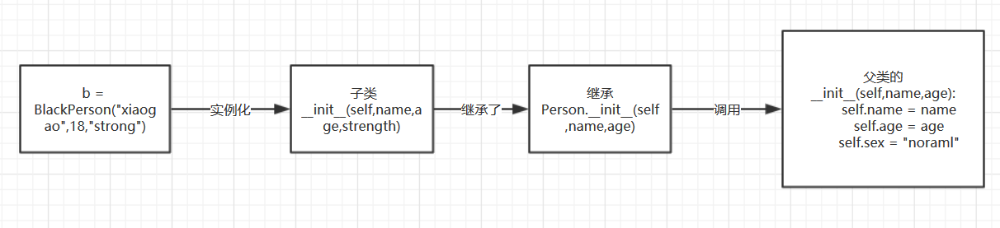
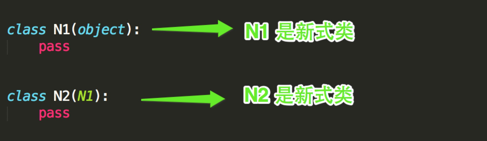

## 四、面向对象之继承

### 1、概述

　在OOP（Object Oriented Programming）程序设计中，当我们定义一个class的时候，可以从某个现有的class **继承**，新的class称为**子类（Subclass）**、**派生类**，而被继承的class称为**基类**、**父类**或**超类**（Base class、Super class）。

对于面向对象的继承来说，其实就是将**多个类共有的方法提取到父类中，子类仅需继承父类而不必一一实现每个方法**。

继承的好处：可以最大化减少代码冗余，实现代码重用。

**Python中继承的特点：**

- Python中一个子类可以同时继承多个父类
- 在继承背景下，Python中的类分为两种：
  - 新式类：定义时继承object类（Python3默认都继承object类）
  - 经典类：什么都不继承（Python2如果显示继承任何类，也不会继承object类）

### 2、继承

**示例1：继承定义**

在类名的括号中写入需要继承的类名即可

```python
class Person(object):
    def talk(self):
        print("person is talking...")
 
class BlackPerson(Person):  #继承Person这个类
    def walk(self):  #定义子类自身的walk方法
        print("BlackPerson is walking.....")
 
b = BlackPerson()
b.talk()   #由于继承了父类的talk()方法，所以可以被调用
b.walk()  #调用子类自身的walk方法

'''
#输出
person is talking...
BlackPerson is walking....
'''.
```

**示例2：构造方法的继承**

说明：因为子类有自己的属性，但是又想继承父类的属性，所以需要先继承，再重构

继承类的构造方法2种写法：

1. 经典类写法：父类.__init(self,name,age)
2. 新式类写法：super(子类,self).__init__(name,age)

注：建议使用新式类的写法，因为使用经典类的写法，在多继承的情况下，会出现重复调用参数的可能

代码如下：

```python
class Person(object):
    def __init__(self,name,age):
        self.name = name
        self.age = age
        self.sex = "noraml"
 
    def talk(self):
        print("person is talking...")
 
class BlackPerson(Person):
    def __init__(self,name,age,strength):  #定义时需要传入父类的属性名
        Person.__init__(self,name,age)  #继承父类的构造方法，也可以写成：super(BlackPerson,self).__init__(name,age)
        self.strength = strength   #定义子类本身的属性
        print(self.name,self.age,self.sex)
 
    def walk(self):
        print("BlackPerson is walking.....")
 
b = BlackPerson("xiaogao",18,"strong")

'''
#输出
xiaogao 18 noraml
'''
```

这边不禁的有一个疑问？我不能重新写一遍，我为啥要继承父类中的方法呢？因为你重新写一遍的话，只能继承self.name和self.age，那self.sex怎么办，它也需要重写吗？所以啊，只有把父类中的构造函数全部继承过来，只能用上面这种办法？那它是怎么实现的呢？我们来画一个图：



**示例3：子类对父类方法的重写**

说明：如果我对父类中的方法不满意，我可以重写父类中的方法，当然还可以继承父类中的方法，但是我们一般不这样干。

```python
class Person(object):
    def __init__(self,name,age):
        self.name = name
        self.age = age
        self.sex = "noraml"
 
    def talk(self):
        print("person is talking...")
 
class BlackPerson(Person):
    def talk(self):  #重写父类的方法
        Person.talk(self)  #调用父类的方法
        print("BlackPerson is talking ...")
 
    def walk(self):
        print("BlackPerson is walking.....")
 
b = BlackPerson("xiaogao",18)  #子类不写，则继承父类的构造方法
b.talk()
b.walk()

'''
#输出
person is talking...
BlackPerson is talking ...
BlackPerson is walking.....
'''
```

其实重写不是上面说的那么简单，只需要子类的方法名和父类的中的方法名一样就算重写了，其实不然，那怎么样才算重写呢？

**重写的条件：**

1. 重写方法的方法名必须和父类中被重写的方法名一模一样
2. 重写方法的传入的参数名和参数的个数必须和父类中被重写的方法一样

我们再来看看下面的例子：

```python
class Person(object):
 
    def talk(self,food):
        print("person is talking...{0}".format(food))
 
class BlackPerson(Person):
 
    def talk(self):  #方法名和父类的方法名一样，但是少了一个food参数
        print("BlackPerson is talking ...")
 
b = BlackPerson("xiaogao",18,"strong")
b.talk()
 
'''
#输出
BlackPerson is talking ...
'''
```

有些同学说，这明明是重写了呀！其实不是重写，根据重写的条件明显两个方法的传入参数名和参数的个数都不一样，其实上面这种只是子类自己写了一个talk方法，只是名字一样，但是传入的参数和参数的个数不一样，并不是重写了父类中的方法。下面这个才是真正的重写：

```python
class Person(object):
 
    def talk(self,food):
        print("person is talking...{0}".format(food))
 
class BlackPerson(Person):
 
    def talk(self,food):  #重写父类的方法(方法名和传入的参数名以及参数的个数与父类的方法一样)
        print("BlackPerson is talking ...{0}".format(food))
 
b = BlackPerson("xiaogao",18,"strong")
b.talk("hotdog")
 
'''
#输出
BlackPerson is talking ...hotdog
'''
```

### 3、多继承

 在python还支持多继承，但是一般我们很少用，有些语言干脆就不支持多继承，有多继承，就会带来两个概念，经典类和新式类。

- Python的类可以继承多个类，Java和C#中则只能继承一个类
- Python的类如果继承了多个类，那么其寻找方法的方式有两种，分别是：**深度优先**和**广度优先**
- 当类是经典类时，多继承情况下，会按照深度优先方式查找
- 当类是新式类时，多继承情况下，会按照广度优先方式查找

**示例1：多继承**：子类可以继承多个父类，就叫多继承

```python
class SchoolMember(object):  #SchoolMember类
    '''学校成员基类'''
    def tell(self):
        print("the schoolmeber is tell...")
 
class School(object):     #School类
    """学校类"""
    def open_branch(self,addr):
        print("openning a new branch in",addr)
 
class Teacher(SchoolMember,School):   #子类Teacher同时继承了SchoolMember,School两个类
    "讲师类"
    def teaching(self):
        "讲课方法"
        print("Teacher xiaogao is teaching python")
 
t1 = Teacher()
t1.tell()   #拥有父类SchoolMember的tell方法
t1.open_branch("shanghai")  #拥有父类School的open_branch方法
```

**示例2：新式类和经典类**

经典类和新式类，从字面上可以看出一个老一个新，新的必然包含了跟多的功能，也是之后推荐的写法，从写法上区分的话，如果 **当前类或者父类继承了object类**，那么该类便是新式类，否则便是经典类。




**经典类多继承**

```python
class D:
    def bar(self):
        print 'D.bar'


class C(D):
    def bar(self):
        print 'C.bar'


class B(D):
    def bar(self):
        print 'B.bar'


class A(B, C):
    def bar(self):
        print 'A.bar'

a = A()
a.bar()
```

执行bar方法时：
- 首先去A类中查找，如果A类中没有，则继续去B类中找，如果B类中么有，则继续去D类中找，如果D类中么有，则继续去C类中找，如果还是未找到，则报错
- 所以，查找顺序：A --> B --> D --> C
- 在上述查找bar方法的过程中，一旦找到，则寻找过程立即中断，便不会再继续找了

**新式类多继承**

```python
class D(object):
    def bar(self):
        print 'D.bar'


class C(D):
    def bar(self):
        print 'C.bar'


class B(D):
    def bar(self):
        print 'B.bar'


class A(B, C):
    def bar(self):
        print 'A.bar'

a = A()
a.bar()
```
执行bar方法时
- 首先去A类中查找，如果A类中没有，则继续去B类中找，如果B类中么有，则继续去C类中找，如果C类中么有，则继续去D类中找，如果还是未找到，则报错
- 所以，查找顺序：A --> B --> C --> D
- 在上述查找bar方法的过程中，一旦找到，则寻找过程立即中断，便不会再继续找了

**经典类**：首先去**A**类中查找，如果A类中没有，则继续去**B**类中找，如果B类中么有，则继续去**D**类中找，如果D类中么有，则继续去**C**类中找，如果还是未找到，则报错

**新式类**：首先去**A**类中查找，如果A类中没有，则继续去**B**类中找，如果B类中么有，则继续去**C**类中找，如果C类中么有，则继续去**D**类中找，如果还是未找到，则报错

> 在上述查找过程中，一旦找到，则寻找过程立即中断，便不会再继续找了

