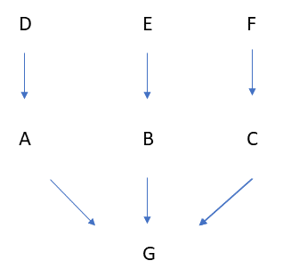
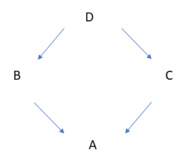

## 五、面向对象特性之继承

### 1、概述

什么是继承？

- 继承是一种新建类的方式，继承的类称为子类或派生类
- 被继承的类称之为父类或基类或超类
- 子类继承父类，也就意味着子类继承了父类所有的属性和方法，且可以直接调用

为什么要有继承？

- 不同类中的相同功能，可以将相同功能定义为一个父类，子类都从其中继承，减少代码冗余

Python中继承的特点：

- 支持多继承
- Python2默认什么都不继承（经典类），Python3默认都继承Object类（新式类）

### 2、继承

**示例1：定义一个单继承和多继承**

```python
class Parent1:
    pass

class Parent2:
    pass

class Son1(Parent1):
    pass

class Son2(Parent1,Parent2):   #多继承
    pass
```

>  上面可以看到，son1类继承Parent1类，son2类继承Parent1类和Parent2类


**示例2：查看类所继承的父类**

```python
class Parent1:
    pass

class Parent2:
    pass

class Son1(Parent1):
    pass

class Son2(Parent1,Parent2):   #多继承
    pass

print(Son1.__bases__)
print(Son2.__bases__)

'''
返回值
(<class '__main__.Parent1'>,)
(<class '__main__.Parent1'>, <class '__main__.Parent2'>)
'''
```

### 3、新式类和经典类

从刚才的例子可以看到子类所继承正确的父类，那父类有没有继承别的类了？

**示例1：Python3环境下查看Parent1和Parent2所继承的类**

```python
class Parent1:
    pass

class Parent2:
    pass

class Son1(Parent1):
    pass

class Son2(Parent1,Parent2):   #多继承
    pass

print(Parent1.__bases__)
print(Parent2.__bases__)

'''
返回值
(<class 'object'>,)
(<class 'object'>,)
'''
```

> 上面可以看到，Parent1和Parent2都继承object类

**示例2：Python2环境下查看Parent1和Parent2所继承的类**

```python
class Parent1:
    pass

class Parent2:
    pass

class Son1(Parent1):
    pass

class Son2(Parent1,Parent2):   #多继承
    pass

print(Parent1.__bases__)
print(Parent2.__bases__)

'''
返回值
()
()
'''
```

python2：类如果没有显示继承任何类的情况下，不继承任何类（经典类）

python3：类如果没有显示继承任何类的情况下，默认都继承object类（新式类）

> 经典类与新式类只在python2有区分，python3中只有新式类

### 4、派生

**什么是派生：**

子类继承了父类 , 父类派生了子类 , 继承是站在子类的角度 , 派生是站在父类的角度 ,。如果派生出的方法与父类的同名了，那么相当于覆盖了父类的方法。

**为什么要有派生？**

父类的方法和属性，功能上子类可能不满足，所以子类需要改写父类的方法。改写的原则，方法必须同名。

**示例1：定义一个老师和学生类**

```python
import pickle


class Student():
    def __init__(self, name, age, gender):
        self.name = name
        self.age = age
        self.gender = gender

    def choose_course(self):
        print('%s is choosing course' % self.name)

    def save(self):
        with open(self.name, 'wb') as f:
            pickle.dump(self, f)


class Teacher():
    def __init__(self, name, age, gender):
        self.name = name
        self.age = age
        self.gender = gender

    def score(self):
        print('%s is score' % self.name)

    def save(self):
        with open(self.name, 'wb') as f:
            pickle.dump(self, f)


stu = Student('egon', 18, 'female')
print(stu.name)
stu.save()

tea = Teacher('jason', 18, 'male')
print(tea.name)
tea.save()
```

发现相同的代码很多，能否将同样的代码放至父类中，子类从父类中继承

**示例2：改写示例1，将相同代码带入people类**

```python
import pickle

class People():
    def __init__(self, name, age, gender):
        self.name = name
        self.age = age
        self.gender = gender

    def save(self):
        with open(self.name, 'wb') as f:
            pickle.dump(self, f)

class Student(People):
    def choose_course(self):
        print('%s is choosing course' % self.name)

class Teacher(People):
    def score(self):
        print('%s is score' % self.name)
```

哇，代码瞬间少了很多，但是现在有个需求，需求在Teacher类加入level级别属性

**示例3：重写父类的方法，写法1指名道姓改**

```python
...省略部分代码
class Teacher(People):
    def __init__(self,name,age,gender,level):
        People.__init__(self,name,age,gender)
        self.level = level

    def score(self):
        print('%s is score' % self.name)
```

直接指名道姓的调用People类进行改写，两三个类好些，如果项目中二三十个类了？

**示例4：重写父类的方法，写法2 super**

super只能用在新式类中 , 在经典类中则只能按照上面的方式进行处理了

super截取官方文档中的一部分

```python
# 相当于super(type, obj),first argument一般是self实例本身
super() -> same as super(__class__, <first argument>)
# 返回非绑定父类对象
super(type) -> unbound super object
# 返回父类的实例
super(type, obj) -> bound super object; requires isinstance(obj, type)
# 返回父类的实例
super(type, type2) -> bound super object; requires issubclass(type2, type)
# type参数为子类
```

Python中一切皆对象 , 所以其实super是一个类 , 在我们使用super时事实上调用了super类的初始化函数 , 产生了一个super对象

首先用super的方式解决上面的问题吧

```python
...省略部分代码
class Teacher(OldboyPeople):
    def __init__(self,name,age,gender,level):
        # People.__init__(self,name,age,gender)
        super(Teacher,self).__init__(name,age,gender)
        self.level=level
        
    def score(self):
        print('%s is score' % self.name)
```

好像没解决，能不能再简单一点。。。

**示例5：重写父类的方法，写法3 super**

```python
...省略部分代码
class Teacher(OldboyPeople):
    def __init__(self,name,age,gender,level):
        # People.__init__(self,name,age,gender)
        # super(Teacher,self).__init__(name,age,gender)
        super().__init__(name,age,gender)
        self.level = level
        
    def score(self):
        print('%s is score' % self.name)
```

super是一个类名 , super( ) 事实上调用了super类的初始化函数 , 产生了一个super对象 , 所以使用super可以避免父类被重复调用.

> super的查找方式遵循MRO表中的顺序 , MRO表往下看

### 5、继承下的属性查找顺序

**①、单继承**

```python
class B:
    def f1(self):
        print('from B f1')

    def f2(self):
        print('from B f2')
        self.f1()
        
class A(B):
    def f1(self):
        print('from A f1')
        
obj = A()
obj.f2()

'''
返回值
from B f2
from A f1
'''
```

上面例子的查看循序是什么了？

- 执行obj.f2方法，A类中没有，查找父类，**执行B类中的f2方法**
- B类中的f2方法，执行self.f1方法，**A类中有f1方法**，直接执行

**②、多继承，链式继承**


如上图，定义多个类链式继承

```python
class D:
    def test(self):
        print('D')

class E:
    def test(self):
        print('E')

class F:
    def test(self):
        print('F')

class A(D):
    def test(self):
        print('A')

class B(E):
    def test(self):
        print('B')

class C(F):
    def test(self):
        print('C')

class G(A,B,C):
    def test(self):
        print('G')

obj = G()
obj.test()
print(G.mro())

'''
返回值
G
[<class '__main__.G'>, <class '__main__.A'>, <class '__main__.D'>, <class '__main__.B'>, <class '__main__.E'>, <class '__main__.C'>, <class '__main__.F'>, <class 'object'>]
'''
```

在Python3中通过`G.mro()`可以获取类的MRO表中的顺序，可以看到访问顺序为 G --> A --> D --> B --> E --> C --> F

```python
class D:
    def test(self):
        print('D')

class E:
    def test(self):
        print('E')

class F:
    def test(self):
        print('F')

class A(D):
    # def test(self):
    #     print('A')
    pass

class B(E):
    def test(self):
        print('B')

class C(F):
    def test(self):
        print('C')

class G(A,B,C):
    # def test(self):
    #     print('G')
    pass

obj = G()
obj.test()
# print(G.mro())
```

在Python2中经典类无法通过`G.mro()`获取类的MRO表中的顺序，通过一个个注释掉G发现访问A、注掉A访问D，可以知道访问顺序为 G --> A --> D --> B --> E --> C --> F

**③、多继承，菱式继承**

如上图，定义多个类链式继承

```python
class D:
    def test(self):
        print('D')

class C(D):
    def test(self):
        print('C')

class B(D):
    def test(self):
        print('B')

class A(B,C):
    def test(self):
        print('A')


obj = A()
obj.test()
print(A.mro())

'''
A
[<class '__main__.A'>, <class '__main__.B'>, <class '__main__.C'>, <class '__main__.D'>, <class 'object'>]
'''
```

在Python3中通过`A.mro()`可以获取类的MRO表中的顺序，可以看到访问顺序为 A --> B --> C --> D

```python
class D:
    # def test(self):
    #     print('D')
    pass

class C(D):
    def test(self):
        print('C')
    pass

class B(D):
    # def test(self):
    #     print('B')
    pass

class A(B,C):
    # def test(self):
    #     print('A')
    pass

obj = A()
obj.test()
# print(A.mro())
```

在Python2中经典类无法通过`G.mro()`获取类的MRO表中的顺序，通过一个个注释掉A发现访问B、注掉B访问D，可以知道访问顺序为A --> B --> D --> C

```python
class D(object):
    def test(self):
        print('D')

class C(D):
    def test(self):
        print('C')


class B(D):
    def test(self):
        print('B')

class A(B,C):
    def test(self):
        print('A')

obj = A()
obj.test()
print(A.mro())

'''
A
[<class '__main__.A'>, <class '__main__.B'>, <class '__main__.C'>, <class '__main__.D'>, <type 'object'>]

'''
```

在Python2中新式类通过`G.mro()`获取类的MRO表中的顺序，访问顺序为 A --> B --> C --> D

**④、小结**

- 链式继承中，经典类和新式类访问顺序一样
- 菱式继承中，经典类**深度优先**，新式类**广度优先**，当然这只存在Python2中