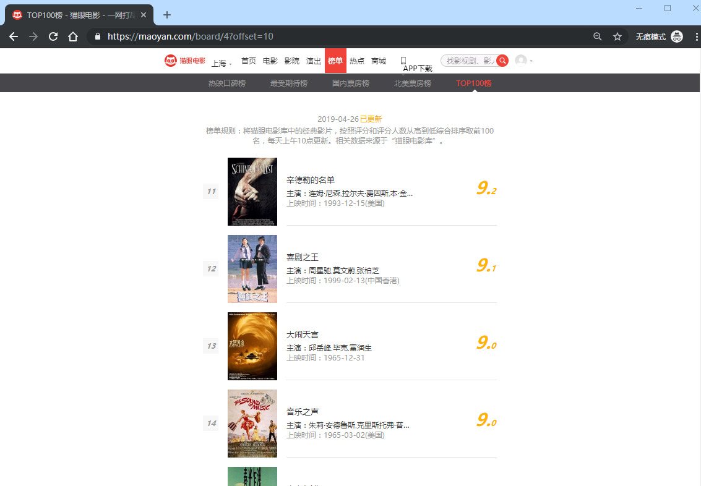
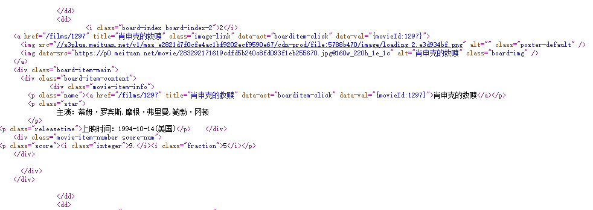

## 爬取猫眼电影TOP100信息

### 1、本节目标

  本节中，我们要提取出猫眼电影TOP100的电影名称、时间、评分、图片等信息，提取的站点URL为[https://maoyan.com/board/4](https://maoyan.com/board/4)，提取的结果会以文件形式保存下来。

  

### 2、准备工作

  在本节开始之前，请确保已经正确安装好了requests库。

  

### 3、抓取分析

  我们需要抓取的目标站点为[https://maoyan.com/board/4](https://maoyan.com/board/4)，打开之后便可以查看到榜单信息，如图3-11所示。 
                                                   
<center> 图3-11 榜单信息</center>
排名第一的电影是霸王别姬，页面中显示的有效信息有影片名称、主演、上映时间、上映地区、评分、图片等信息。

将网页滚动到最下方，可以发现有分页的列表，直接点击第2页，观察页面的URL和内容发生了怎样的变化，如图3-12所示。


<center>图3-12 页面URL变化</center>

可以发现页面的URL变成<https://maoyan.com/board/4?offset=10>，比之前的URL多了一个参数，那就是`offset=10`，而目前显示的结果是排行11\~20名的电影，初步推断这是一个偏移量的参数。再点击下一页，发现页面的URL变成了<https://maoyan.com/board/4?offset=20>，参数`offset`变成了20，而显示的结果是排行21\~30的电影。

由此可以总结出规律，`offset`代表偏移量值，如果偏移量为`n`，则显示的电影序号就是`n+1`到`n+10`，每页显示10个。所以，如果想获取TOP100电影，只需要分开请求10次，而10次的`offset`参数分别设置为0、10、20、…90即可，这样获取不同的页面之后，再用正则表达式提取出相关信息，就可以得到TOP100的所有电影信息了。

### 4、爬取首页

接下来用代码实现这个过程。首先抓取第一页的内容。我们实现了`get_one_page()`方法，并给它传入`url`参数。然后将抓取的页面结果返回，再通过`main()`方法调用。初步代码实现如下：

```python
import requests

def get_one_page(url):
    response = requests.get(url)
    if response.status_code == 200:
        return response.text
    return None

def main():
    url = 'https://maoyan.com/board/4'
    html = get_one_page(url)
    print(html)

if __name__ == '__main__':
    main()
```

这样运行之后，就可以成功获取首页的源代码了。获取源代码后，就需要解析页面，提取出我们想要的信息。

### 5、正则提取

接下来，回到网页看一下页面的真实源码。右击**查看网页源代码**（Google Chrom浏览器），如图3-13所示。



可以看到，一部电影信息对应的源代码是一个`dd`节点，我们用正则表达式来提取这里面的一些电影信息。首先，需要提取它的排名信息。而它的排名信息是在`class`为`board-index`的`i`节点内，这里利用非贪婪匹配来提取`i`节点内的信息，正则表达式写为：

```shell
<dd>.*?board-index.*?>(.*?)</i>
```

随后需要提取电影的图片。可以看到，后面有`a`节点，其内部有两个`img`节点。经过检查后发现，第二个`img`节点的`data-src`属性是图片的链接。这里提取第二个`img`节点的`data-src`属性，正则表达式可以改写如下：

```shell
<dd>.*?board-index.*?>(.*?)</i>.*?data-src="(.*?)"
```

再往后，需要提取电影的名称，它在后面的`p`节点内，`class`为`name`。所以，可以用`name`做一个标志位，然后进一步提取到其内`a`节点的正文内容，此时正则表达式改写如下：

```shell
<dd>.*?board-index.*?>(.*?)</i>.*?data-src="(.*?)".*?name.*?a.*?>(.*?)</a>
```

再提取主演、发布时间、评分等内容时，都是同样的原理。最后，正则表达式写为：

```shell
<dd>.*?board-index.*?>(.*?)</i>.*?data-src="(.*?)".*?name.*?a.*?>(.*?)</a>.*?star.*?>(.*?)</p>.*?releasetime.*?>(.*?)</p>.*?integer.*?>(.*?)</i>.*?fraction.*?>(.*?)</i>.*?</dd>
```

这样一个正则表达式可以匹配一个电影的结果，里面匹配了7个信息。接下来，通过调用`findall()`方法提取出所有的内容。

接下来，我们再定义解析页面的方法`parse_one_page()`，主要是通过正则表达式来从结果中提取出我们想要的内容，实现代码如下：

```python
def parse_one_page(html):
    pattern = re.compile(
        '<dd>.*?board-index.*?>(.*?)</i>.*?data-src="(.*?)".*?name.*?a.*?>(.*?)</a>.*?star.*?>(.*?)</p>.*?releasetime.*?>(.*?)</p>.*?integer.*?>(.*?)</i>.*?fraction.*?>(.*?)</i>.*?</dd>',
        re.S)
    items = re.findall(pattern, html)
    print(items)
```

这样就可以成功地将一页的10个电影信息都提取出来，这是一个列表形式，输出结果如下：

```shell
[('1', 'https://p1.meituan.net/movie/20803f59291c47e1e116c11963ce019e68711.jpg@160w_220h_1e_1c', '霸王别姬', '\n                主演：张国荣,张丰毅,巩俐\n        ', '上映时间：1993-01-01', '9.', '5'), ('2', 'https://p0.meituan.net/movie/283292171619cdfd5b240c8fd093f1eb255670.jpg@160w_220h_1e_1c', '肖申克的救赎', '\n                主演：蒂姆·罗宾斯,摩根·弗里曼,鲍勃·冈顿\n        ', '上映时间：1994-10-14(美国)', '9.', '5'), ('3', 'https://p0.meituan.net/movie/289f98ceaa8a0ae737d3dc01cd05ab052213631.jpg@160w_220h_1e_1c', '罗马假日', '\n                主演：格利高里·派克,奥黛丽·赫本,埃迪·艾伯特\n        ', '上映时间：1953-09-02(美国)', '9.', '1'), ('4', 'https://p1.meituan.net/movie/6bea9af4524dfbd0b668eaa7e187c3df767253.jpg@160w_220h_1e_1c', '这个杀手不太冷', '\n                主演：让·雷诺,加里·奥德曼,娜塔莉·波特曼\n        ', '上映时间：1994-09-14(法国)', '9.', '5'), ('5', 'https://p1.meituan.net/movie/b607fba7513e7f15eab170aac1e1400d878112.jpg@160w_220h_1e_1c', '泰坦尼克号', '\n                主演：莱昂纳多·迪卡普里奥,凯特·温丝莱特,比利·赞恩\n        ', '上映时间：1998-04-03', '9.', '5'), ('6', 'https://p0.meituan.net/movie/da64660f82b98cdc1b8a3804e69609e041108.jpg@160w_220h_1e_1c', '唐伯虎点秋香', '\n                主演：周星驰,巩俐,郑佩佩\n        ', '上映时间：1993-07-01(中国香港)', '9.', '1'), ('7', 'https://p0.meituan.net/movie/b076ce63e9860ecf1ee9839badee5228329384.jpg@160w_220h_1e_1c', '千与千寻', '\n                主演：柊瑠美,入野自由,夏木真理\n        ', '上映时间：2001-07-20(日本)', '9.', '3'), ('8', 'https://p0.meituan.net/movie/46c29a8b8d8424bdda7715e6fd779c66235684.jpg@160w_220h_1e_1c', '魂断蓝桥', '\n                主演：费雯·丽,罗伯特·泰勒,露塞尔·沃特森\n        ', '上映时间：1940-05-17(美国)', '9.', '2'), ('9', 'https://p0.meituan.net/movie/223c3e186db3ab4ea3bb14508c709400427933.jpg@160w_220h_1e_1c', '乱世佳人', '\n                主演：费雯·丽,克拉克·盖博,奥利维娅·德哈维兰\n        ', '上映时间：1939-12-15(美国)', '9.', '1'), ('10', 'https://p1.meituan.net/movie/ba1ed511668402605ed369350ab779d6319397.jpg@160w_220h_1e_1c', '天空之城', '\n                主演：寺田农,鹫尾真知子,龟山助清\n        ', '上映时间：1992', '9.', '1')]

```

但这样还不够，数据比较杂乱，我们再将匹配结果处理一下，遍历提取结果并生成字典，此时方法改写如下：

```python
def parse_one_page(html):
    pattern = re.compile(
        '<dd>.*?board-index.*?>(.*?)</i>.*?data-src="(.*?)".*?name.*?a.*?>(.*?)</a>.*?star.*?>(.*?)</p>.*?releasetime.*?>(.*?)</p>.*?integer.*?>(.*?)</i>.*?fraction.*?>(.*?)</i>.*?</dd>',
        re.S)
    items = re.findall(pattern, html)
    for item in items:
        yield {
            'index': item[0],
            'image': item[1],
            'title': item[2].strip(),
            'actor': item[3].strip()[3:] if len(item[3]) > 3 else '',
            'time': item[4].strip()[5:] if len(item[4]) > 5 else '',
            'score': item[5].strip() + item[6].strip()
        }
```

这样就可以成功提取出电影的排名、图片、标题、演员、时间、评分等内容了，并把它赋值为一个个的字典，形成结构化数据。运行结果如下：

```shell
{'index': '1', 'image': 'https://p1.meituan.net/movie/20803f59291c47e1e116c11963ce019e68711.jpg@160w_220h_1e_1c', 'title': '霸王别姬', 'actor': '张国荣,张丰毅,巩俐', 'time': '1993-01-01', 'score': '9.5'}
{'index': '2', 'image': 'https://p0.meituan.net/movie/283292171619cdfd5b240c8fd093f1eb255670.jpg@160w_220h_1e_1c', 'title': '肖申克的救赎', 'actor': '蒂姆·罗宾斯,摩根·弗里曼,鲍勃·冈顿', 'time': '1994-10-14(美国)', 'score': '9.5'}
{'index': '3', 'image': 'https://p0.meituan.net/movie/289f98ceaa8a0ae737d3dc01cd05ab052213631.jpg@160w_220h_1e_1c', 'title': '罗马假日', 'actor': '格利高里·派克,奥黛丽·赫本,埃迪·艾伯特', 'time': '1953-09-02(美国)', 'score': '9.1'}
{'index': '4', 'image': 'https://p1.meituan.net/movie/6bea9af4524dfbd0b668eaa7e187c3df767253.jpg@160w_220h_1e_1c', 'title': '这个杀手不太冷', 'actor': '让·雷诺,加里·奥德曼,娜塔莉·波特曼', 'time': '1994-09-14(法国)', 'score': '9.5'}
{'index': '5', 'image': 'https://p1.meituan.net/movie/b607fba7513e7f15eab170aac1e1400d878112.jpg@160w_220h_1e_1c', 'title': '泰坦尼克号', 'actor': '莱昂纳多·迪卡普里奥,凯特·温丝莱特,比利·赞恩', 'time': '1998-04-03', 'score': '9.5'}
{'index': '6', 'image': 'https://p0.meituan.net/movie/da64660f82b98cdc1b8a3804e69609e041108.jpg@160w_220h_1e_1c', 'title': '唐伯虎点秋香', 'actor': '周星驰,巩俐,郑佩佩', 'time': '1993-07-01(中国香港)', 'score': '9.1'}
{'index': '7', 'image': 'https://p0.meituan.net/movie/b076ce63e9860ecf1ee9839badee5228329384.jpg@160w_220h_1e_1c', 'title': '千与千寻', 'actor': '柊瑠美,入野自由,夏木真理', 'time': '2001-07-20(日本)', 'score': '9.3'}
{'index': '8', 'image': 'https://p0.meituan.net/movie/46c29a8b8d8424bdda7715e6fd779c66235684.jpg@160w_220h_1e_1c', 'title': '魂断蓝桥', 'actor': '费雯·丽,罗伯特·泰勒,露塞尔·沃特森', 'time': '1940-05-17(美国)', 'score': '9.2'}
{'index': '9', 'image': 'https://p0.meituan.net/movie/223c3e186db3ab4ea3bb14508c709400427933.jpg@160w_220h_1e_1c', 'title': '乱世佳人', 'actor': '费雯·丽,克拉克·盖博,奥利维娅·德哈维兰', 'time': '1939-12-15(美国)', 'score': '9.1'}
{'index': '10', 'image': 'https://p1.meituan.net/movie/ba1ed511668402605ed369350ab779d6319397.jpg@160w_220h_1e_1c', 'title': '天空之城', 'actor': '寺田农,鹫尾真知子,龟山助清', 'time': '1992', 'score': '9.1'}
```

到此为止，我们就成功提取了单页的电影信息。

### 6、写入文件

随后，我们将提取的结果写入文件，这里直接写入到一个文本文件中。这里通过JSON库的`dumps()`方法实现字典的序列化，并指定`ensure_ascii`参数为`False`，这样可以保证输出结果是中文形式而不是Unicode编码。代码如下：

```python
def write_to_json(content):
    with open('result.txt', 'a') as f:
        print(type(json.dumps(content)))
        f.write(json.dumps(content, ensure_ascii=False,).encode('utf-8'))
```

通过调用`write_to_json()`方法即可实现将字典写入到文本文件的过程，此处的`content`参数就是一部电影的提取结果，是一个字典。

### 7、整合代码

最后，实现`main()`方法来调用前面实现的方法，将单页的电影结果写入到文件。相关代码如下：

```python
def main():
    url = 'https://maoyan.com/board/4'
    html = get_one_page(url)
    for item in parse_one_page(html):
        write_to_json(item)
```

到此为止，我们就完成了单页电影的提取，也就是首页的10部电影可以成功提取并保存到文本文件中了。

8、分页爬取

因为我们需要抓取的是TOP100的电影，所以还需要遍历一下，给这个链接传入`offset`参数，实现其他90部电影的爬取，此时添加如下调用即可：

```python
if __name__ == '__main__':
    for i in range(10):
        main(offset=i * 10)
```

这里还需要将`main()`方法修改一下，接收一个`offset`值作为偏移量，然后构造URL进行爬取。实现代码如下：

```python
def main(offset):
    url = 'https://maoyan.com/board/4?offset=' + str(offset)
    html = get_one_page(url)
    for item in parse_one_page(html):
        print(item)
        write_to_file(item)
```

到此为止，我们的猫眼电影TOP100的爬虫就全部完成了，再稍微整理一下，完整的代码如下：

```python
import json
import requests
from requests.exceptions import RequestException
import re
import time

def get_one_page(url):
    try:
        response = requests.get(url)
        if response.status_code == 200:
            return response.text
        return None
    except RequestException:
        return None

def parse_one_page(html):
    pattern = re.compile('<dd>.*?board-index.*?>(\d+)</i>.*?data-src="(.*?)".*?name"><a'
                         + '.*?>(.*?)</a>.*?star">(.*?)</p>.*?releasetime">(.*?)</p>'
                         + '.*?integer">(.*?)</i>.*?fraction">(.*?)</i>.*?</dd>', re.S)
    items = re.findall(pattern, html)
    for item in items:
        yield {
            'index': item[0],
            'image': item[1],
            'title': item[2],
            'actor': item[3].strip()[3:],
            'time': item[4].strip()[5:],
            'score': item[5] + item[6]
        }

def write_to_file(content):
    with open('result.txt', 'a', encoding='utf-8') as f:
        f.write(json.dumps(content, ensure_ascii=False) + '\n')

def main(offset):
    url = 'https://maoyan.com/board/4?offset=' + str(offset)
    html = get_one_page(url)
    for item in parse_one_page(html):
        print(item)
        write_to_file(item)

if __name__ == '__main__':
    for i in range(10):
        main(offset=i * 10)
        time.sleep(1)
```

现在猫眼多了反爬虫，如果速度过快，则会无响应，所以这里又增加了一个延时等待。

###  9. 运行结果

```python
{'index': '1', 'image': 'https://p1.meituan.net/movie/20803f59291c47e1e116c11963ce019e68711.jpg@160w_220h_1e_1c', 'title': '霸王别姬', 'actor': '张国荣,张丰毅,巩俐', 'time': '1993-01-01', 'score': '9.5'}
{'index': '2', 'image': 'https://p0.meituan.net/movie/283292171619cdfd5b240c8fd093f1eb255670.jpg@160w_220h_1e_1c', 'title': '肖申克的救赎', 'actor': '蒂姆·罗宾斯,摩根·弗里曼,鲍勃·冈顿', 'time': '1994-10-14(美国)', 'score': '9.5'}
{'index': '3', 'image': 'https://p0.meituan.net/movie/289f98ceaa8a0ae737d3dc01cd05ab052213631.jpg@160w_220h_1e_1c', 'title': '罗马假日', 'actor': '格利高里·派克,奥黛丽·赫本,埃迪·艾伯特', 'time': '1953-09-02(美国)', 'score': '9.1'}
{'index': '4', 'image': 'https://p1.meituan.net/movie/6bea9af4524dfbd0b668eaa7e187c3df767253.jpg@160w_220h_1e_1c', 'title': '这个杀手不太冷', 'actor': '让·雷诺,加里·奥德曼,娜塔莉·波特曼', 'time': '1994-09-14(法国)', 'score': '9.5'}
{'index': '5', 'image': 'https://p1.meituan.net/movie/b607fba7513e7f15eab170aac1e1400d878112.jpg@160w_220h_1e_1c', 'title': '泰坦尼克号', 'actor': '莱昂纳多·迪卡普里奥,凯特·温丝莱特,比利·赞恩', 'time': '1998-04-03', 'score': '9.5'}
{'index': '6', 'image': 'https://p0.meituan.net/movie/da64660f82b98cdc1b8a3804e69609e041108.jpg@160w_220h_1e_1c', 'title': '唐伯虎点秋香', 'actor': '周星驰,巩俐,郑佩佩', 'time': '1993-07-01(中国香港)', 'score': '9.1'}
{'index': '7', 'image': 'https://p0.meituan.net/movie/b076ce63e9860ecf1ee9839badee5228329384.jpg@160w_220h_1e_1c', 'title': '千与千寻', 'actor': '柊瑠美,入野自由,夏木真理', 'time': '2001-07-20(日本)', 'score': '9.3'}
{'index': '8', 'image': 'https://p0.meituan.net/movie/46c29a8b8d8424bdda7715e6fd779c66235684.jpg@160w_220h_1e_1c', 'title': '魂断蓝桥', 'actor': '费雯·丽,罗伯特·泰勒,露塞尔·沃特森', 'time': '1940-05-17(美国)', 'score': '9.2'}
{'index': '9', 'image': 'https://p0.meituan.net/movie/223c3e186db3ab4ea3bb14508c709400427933.jpg@160w_220h_1e_1c', 'title': '乱世佳人', 'actor': '费雯·丽,克拉克·盖博,奥利维娅·德哈维兰', 'time': '1939-12-15(美国)', 'score': '9.1'}
{'index': '10', 'image': 'https://p1.meituan.net/movie/ba1ed511668402605ed369350ab779d6319397.jpg@160w_220h_1e_1c', 'title': '天空之城', 'actor': '寺田农,鹫尾真知子,龟山助清', 'time': '1992', 'score': '9.1'}
{'index': '11', 'image': 'https://p0.meituan.net/movie/b0d986a8bf89278afbb19f6abaef70f31206570.jpg@160w_220h_1e_1c', 'title': '辛德勒的名单', 'actor': '连姆·尼森,拉尔夫·费因斯,本·金斯利', 'time': '1993-12-15(美国)', 'score': '9.2'}
{'index': '12', 'image': 'https://p1.meituan.net/movie/18e3191039d5e71562477659301f04aa61905.jpg@160w_220h_1e_1c', 'title': '喜剧之王', 'actor': '周星驰,莫文蔚,张柏芝', 'time': '1999-02-13(中国香港)', 'score': '9.1'}
{'index': '13', 'image': 'https://p1.meituan.net/movie/14a7b337e8063e3ce05a5993ed80176b74208.jpg@160w_220h_1e_1c', 'title': '大闹天宫', 'actor': '邱岳峰,毕克,富润生', 'time': '1965-12-31', 'score': '9.0'}
{'index': '14', 'image': 'https://p1.meituan.net/movie/6bc004d57358ee6875faa5e9a1239140128550.jpg@160w_220h_1e_1c', 'title': '音乐之声', 'actor': '朱莉·安德鲁斯,克里斯托弗·普卢默,埃琳诺·帕克', 'time': '1965-03-02(美国)', 'score': '9.0'}
{'index': '15', 'image': 'https://p0.meituan.net/movie/ae7245920d95c03765fe1615f3a1fe3865785.jpg@160w_220h_1e_1c', 'title': '春光乍泄', 'actor': '张国荣,梁朝伟,张震', 'time': '1997-05-30(中国香港)', 'score': '9.2'}
.....
```

这里省略了部分输出结果。可以看到，这样就成功地把TOP100的电影信息爬取下来了。

《python3网络爬虫实战》基本库的使用