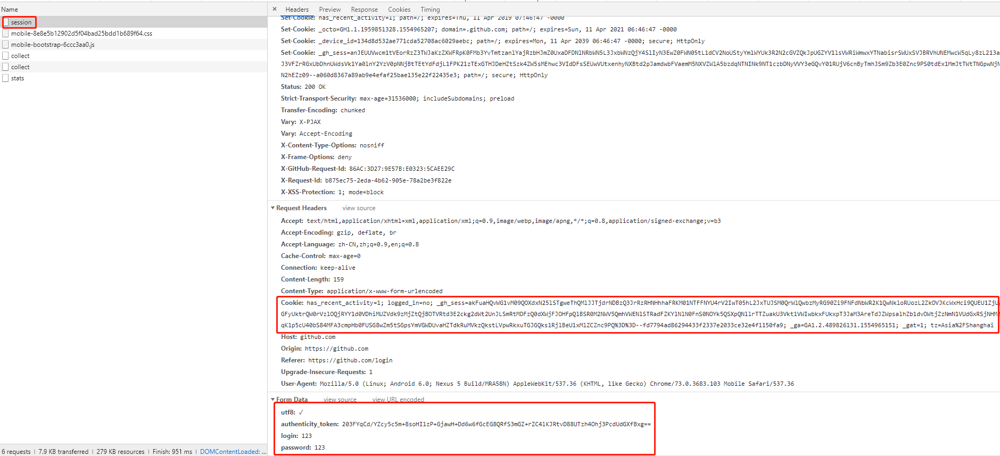

## 四、POST请求模拟登陆GitHub

### 1、分析登陆页面

发送一个登陆请求，从浏览器中分析发现，**发送登陆的POST请求，将用户名、密码和token放在请求体中，cookie放在请求头中**，如下图：



### 2、登陆步骤

- 请求登陆页面，获取token cookie
- 发送登陆的POST请求，将用户名、密码和token放在请求体中，cookie放在请求头中

```python
import requests
import re

login_url = "https://github.com/login"
headers = {"user-agent":"Mozilla/5.0 (Windows NT 10.0; Win64; x64) AppleWebKit/537.36 (KHTML, like Gecko) Chrome/73.0.3683.103 Safari/537.36"}

## 1、获取token 和 cookie
res = requests.get(login_url,headers=headers)
print(res.status_code)
token = re.search('name="authenticity_token" value="(.*?)"',res.text).group(1)
# 从登陆URL中获取token


login_cookie = res.cookies.get_dict()
# 获取cookie

## 2、发送登陆请求
requests.post("https://github.com/sessin",
              headers={
                    "user-agent":"Mozilla/5.0 (Windows NT 10.0; Win64; x64) AppleWebKit/537.36 (KHTML, like Gecko) Chrome/73.0.3683.103 Safari/537.36"
              },cookies = login_cookie,
              data={
                "commit": "Sign in",
                "utf8": "✓",
                "authenticity_token": token,
                "login": "123",
                "password": "123"
              },allow_redirects = False)

print(res.status_code)
```

